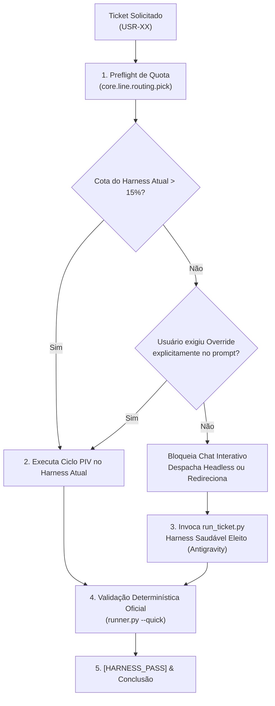

# 19 - Run Ticket: Ciclo Canônico de Execução com Roteador de Modelos

Esta skill governa o ciclo de vida ponta a ponta de desenvolvimento de tickets na Dark Factory, integrando o **Roteador Unificado de Modelos** com seleção dinâmica por margem de cota (*Dynamic Headroom*), bloqueio preventivo de contas exauridas (*fail-closed* em $\le 15.0\%$) e o ciclo iterativo Prime-Plan-Implement-Validate (PIV).

---

## 1. Contratos Normativos da Etapa

### Regra Inviolável de Proteção de Quota e Auto-Bloqueio Interativo
1. **Preflight Obrigatório de Cota**:
   - Antes de iniciar qualquer desenvolvimento, o agente/harness deve consultar a telemetria ao vivo via:
     ```powershell
     python -c "from core.line.routing import pick; print(pick('development', ['harness:claude', 'harness:codex', 'harness:grok', 'harness:antigravity']))"
     ```
   - O roteador avalia todas as contas conectadas. Qualquer conta com cota residual semanal ou da janela móvel $\le 15.0\%$ está em estado crítico e é **estritamente inelegível**.

2. **Bloqueio no Chat Interativo (Anti-Queima de Cota)**:
   - Se o usuário solicitar o desenvolvimento de um ticket diretamente no chat de um harness cuja conta esteja em estado crítico ($\le 15.0\%$), o agente é **TERMINANTEMENTE PROIBIDO** de implementar o código com seu próprio modelo.
   - O agente deve:
     a) Recusar a implementação local no chat;
     b) Informar a cota atual e que ela está abaixo do limiar de segurança ($15\%$);
     c) Orientar o usuário a migrar para o harness saudável eleito (ex.: Antigravity) ou invocar o launcher headless `python run_ticket.py <TICKET_ID>`.

3. **Exceção de Override Explícito pelo Usuário**:
   - **A implementação em um harness com cota $\le 15.0\%$ SÓ É PERMITIDA se o usuário exigir explicitamente no prompt** (ex.: *"forçar execução neste harness"*, *"ignorar limite de cota"*, *"estou ciente da cota crítica, prossiga"* ou via flag `--force` / `--allow-critical-quota`).
   - Sem essa instrução textual inequívoca, o agente deve falhar fechado (*fail-closed*).

---

## 2. Protocolo de Execução do Ticket



### Passo a Passo Operacional:

1. **Preflight e Erupção de Telemetria**:
   O script `run_ticket.py` ou a linha autônoma inspeciona os 4 provedores em tempo real (`.factory/usage/providers/`).
   - Se Codex estiver em 2%, Claude em 3% e Grok em 2.8%, o Antigravity (~53%+) é eleito como executor primário.
   - Se todas as contas de assinatura estiverem $\le 15\%$, o fallback é acionado para o OpenRouter (DeepSeek V4.1 Flash), desde que haja saldo em dólar confirmado (`available_credit_usd > 0`).

2. **Execução Headless ou Assistida**:
   - O executor recebe o ticket, prepara a branch de trabalho isolada (`core.line.workspace`), gera os testes unitários primeiro (TDD) e escreve o código funcional.
   - **Loop de Auto-Correção Técnico**: Se os testes falharem, o `DevelopmentStage` não aborta: ele itera até 5 vezes corrigindo o código com base nos logs destilados de erro.
   - **Dúvidas de Negócio e Ambiguidade (Gate G1)**: Se houver ambiguidade material, uma `HumanRequest` é gerada com notificação via Telegram (Jarvis) e DarkHub, aguardando resposta humana sem inventar parâmetros.

3. **Validação Obrigatória do Portão**:
   Toda entrega sob esta skill deve passar obrigatoriamente pelo portão único da fábrica:
   ```powershell
   python core/harness/runner.py --quick
   ```
   Nenhum ticket é considerado concluído sem o marcador `[HARNESS_PASS]`.

---

## 3. Comandos de Referência para o Operador

- **Executar ticket pelo roteador automático (Headless):**
  ```powershell
  python C:\dev\DarkFac\run_ticket.py USR-XX
  ```

- **Forçar execução mesmo abaixo do limiar de cota (Override Explícito):**
  ```powershell
  python C:\dev\DarkFac\run_ticket.py USR-XX --force
  ```

- **Criar nova demanda e despachar imediatamente:**
  ```powershell
  python C:\dev\DarkFac\run_ticket.py --create --title "Minha Demanda" --problem "Descricao do problema" --criteria "Criterio 1" "Criterio 2"
  ```

- **Consultar estado ao vivo de todas as cotas:**
  ```powershell
  python -m core.usage.cli accounts --refresh
  ```
