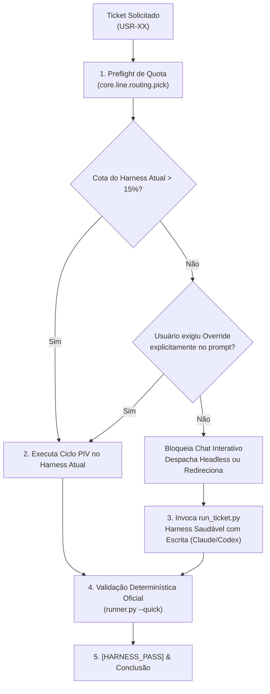

# 19 - Run Ticket: Ciclo Canônico de Execução com Roteador de Modelos

Esta skill governa o ciclo de vida ponta a ponta de desenvolvimento de tickets na Dark Factory, integrando o **Roteador Unificado de Modelos** com seleção dinâmica por margem de cota (*Dynamic Headroom*), bloqueio preventivo de contas exauridas (*fail-closed* em $\le 15.0\%$) e o ciclo iterativo Prime-Plan-Implement-Validate (PIV).

---

## 1. Contratos Normativos da Etapa

### Regra Inviolável de Proteção de Quota e Auto-Bloqueio Interativo
1. **Preflight Obrigatório de Cota**:
   - Antes de iniciar qualquer desenvolvimento, o agente/harness deve consultar a telemetria ao vivo via:
     ```powershell
     python -c "from core.line.routing import pick; print(pick('development', ['harness:claude', 'harness:codex', 'harness:grok', 'harness:antigravity']))"
     ```
   - O roteador avalia todas as contas conectadas. Qualquer conta com cota residual semanal ou da janela móvel $\le 15.0\%$ está em estado crítico e é **estritamente inelegível**.

2. **Bloqueio no Chat Interativo (Anti-Queima de Cota)**:
   - Se o usuário solicitar o desenvolvimento de um ticket diretamente no chat de um harness cuja conta esteja em estado crítico ($\le 15.0\%$), o agente é **TERMINANTEMENTE PROIBIDO** de implementar o código com seu próprio modelo.
   - O agente deve:
     a) Recusar a implementação local no chat;
     b) Informar a cota atual e que ela está abaixo do limiar de segurança ($15\%$);
     c) Orientar o usuário a migrar para o harness saudável eleito com capacidade de escrita (Claude, Codex ou Grok Build) ou invocar o launcher headless `python C:\dev\DarkFac\run_ticket.py <TICKET_ID>`.

3. **Exceção de Override Explícito pelo Usuário**:
   - **A implementação em um harness com cota $\le 15.0\%$ SÓ É PERMITIDA se o usuário exigir explicitamente no prompt** (ex.: *"forçar execução neste harness"*, *"ignorar limite de cota"*, *"estou ciente da cota crítica, prossiga"* ou via flag `--force`).
   - Sem essa instrução textual inequívoca, o agente deve falhar fechado (*fail-closed*).


---

## 2. Protocolo de Execução do Ticket


```mermaid
flowchart TD
    Start["Ticket Solicitado<br/>(USR-XX)"] --> QuotaCheck["1. Preflight de Quota<br/>(core.line.routing.pick)"]
    QuotaCheck --> Evaluate{"Cota do Harness Atual > 15%?"}
    Evaluate -->|Sim| PIVLoop["2. Executa Ciclo PIV no Harness Atual"]
    Evaluate -->|Não| CheckOverride{"Usuário exigiu Override<br/>explicitamente no prompt?"}
    CheckOverride -->|Sim| PIVLoop
    CheckOverride -->|Não| Block["Bloqueia Chat Interativo<br/>Despacha Headless ou Redireciona"]
    Block --> DispatchHealthy["3. Invoca run_ticket.py<br/>Harness Saudável com Escrita (Claude/Codex)"]
    PIVLoop --> Validate["4. Validação Determinística Oficial<br/>(runner.py --quick)"]
    DispatchHealthy --> Validate
    Validate --> Done["5. [HARNESS_PASS] & Conclusão"]
```

### Passo a Passo Operacional:

1. **Preflight e Erupção de Telemetria**:
   O script `run_ticket.py` ou a linha autônoma inspeciona os 4 provedores em tempo real (`.factory/usage/providers/`).
   - O roteador só elege harnesses que declaram o modo exigido pelo estágio (`core.line.agent_cli.HARNESS_CAPABILITIES`): o desenvolvimento exige `write`, que Claude, Codex e Grok Build (USR-109) implementam. O Antigravity é somente leitura (grill/planning/review) e nunca é eleito para `development`, mesmo saudável; se nenhum harness com `write` estiver acima de $15\%$, não há rota (fail-closed).
   - Se todas as contas de assinatura estiverem $\le 15\%$, o fallback é acionado para o OpenRouter (DeepSeek V4.1 Flash) apenas em estágios de leitura (ele não escreve no worktree), desde que haja saldo em dólar confirmado (`available_credit_usd > 0`).

2. **Execução Headless ou Assistida**:
   - O executor recebe o ticket, prepara a branch de trabalho isolada (`core.line.workspace`), gera os testes unitários primeiro (TDD) e escreve o código funcional.
   - **Loop de Auto-Correção Técnico**: Se os testes falharem, o `DevelopmentStage` não aborta: ele itera até 3 vezes corrigindo o código com base nos logs destilados de erro.
   - **Dúvidas de Negócio e Ambiguidade (Gate G1)**: Se houver ambiguidade material, uma `HumanRequest` é gerada com notificação via Telegram (Jarvis) e DarkHub, aguardando resposta humana sem inventar parâmetros.

3. **Validação Obrigatória do Portão**:
   Toda entrega sob esta skill deve passar obrigatoriamente pelo portão único da fábrica:
   ```powershell
   python core/harness/runner.py --quick
   ```
   Nenhum ticket é considerado concluído sem o marcador `[HARNESS_PASS]`.

---

## 2b. Harness de Operação como Desenvolvedor Principal (USR-109)

Regra do owner: se o usuário opera a fábrica por um harness específico, esse harness é o desenvolvedor principal do estágio `development` sempre que sua cota estiver acima do piso crítico de $15\%$.

1. **Harness de operação** (`core/line/operating_harness.py`), por ordem de precedência: parâmetro explícito `pick(operating_harness=...)` (ou `run_ticket --harness`), variável `DARKFAC_OPERATING_HARNESS` (`claude|codex|grok|antigravity`), autodetecção pelas variáveis de ambiente do harness pai, nenhum. Sinais ambíguos (mais de um harness) valem como nenhum: o roteador nunca chuta. Pump, worker e nuvem não têm harness de operação e seguem exatamente o Dynamic Headroom.
2. **Passo de preferência** (só estágio `development`): depois dos filtros de sempre (`host_caps`, modo `write` declarado, modelo proibido, `exclude`, cooldown, cota desconhecida, cota $\le 15\%$), se o harness de operação sobreviveu ele é **eleito**, vencendo o maior headroom e a preferência por faixa de complexidade. O harness de operação entra como candidato extra mesmo fora da cascata, mas nunca participa do ranking por headroom: só é eleito por este passo.
3. **Se não sobreviveu** (crítico, cooldown, cota desconhecida, sem `write`), vale a regra de sempre. O piso de $15\%$ nunca é relaxado pela preferência.
4. **Prioridade, não trava**: se o harness de operação entrar em rate limit no meio do ticket, o retry o exclui e o roteador volta ao maior headroom.
5. **Revisão** continua em `other_family_than_development`: o revisor nunca é da mesma família do implementador (inclui Grok e Antigravity).
6. Subagentes mais simples e execução de testes no desktop continuam livres: a preferência decide só quem escreve o código do ticket.

---

## 3. Comandos de Referência para o Operador

- **Executar ticket pelo roteador automático (Headless):**
  ```powershell
  python C:\dev\DarkFac\run_ticket.py USR-XX
  ```

- **Forçar execução mesmo abaixo do limiar de cota (Override Explícito):**
  ```powershell
  python C:\dev\DarkFac\run_ticket.py USR-XX --force
  ```

- **Criar nova demanda e despachar imediatamente:**
  ```powershell
  python C:\dev\DarkFac\run_ticket.py --create --title "Minha Demanda" --problem "Descricao do problema" --criteria "Criterio 1" "Criterio 2"
  ```

- **Consultar estado ao vivo de todas as cotas:**
  ```powershell
  python -m core.usage.cli accounts --refresh
  ```

---

## 4. Binding com a Esteira (HF-27)

- **Papel do run_ticket.py**: Lançador headless e interativo local para desenvolvimento focado de tickets individuais fora da esteira contínua.
- **Roteamento Unificado**: Tanto o `run_ticket.py` quanto a linha de produção contínua consomem `core.line.routing.pick` e a mesma matriz de capacidades (`core.line.agent_cli.HARNESS_CAPABILITIES`), garantindo que apenas harnesses com capacidade `write` (Claude, Codex, Grok Build) sejam eleitos para implementação.
- **Configuração Canônica**: Configurações de timeout, modelos e provedores são lidas diretamente de `.factory/config/line_routing.json`, evitando duplicidade de regras.

