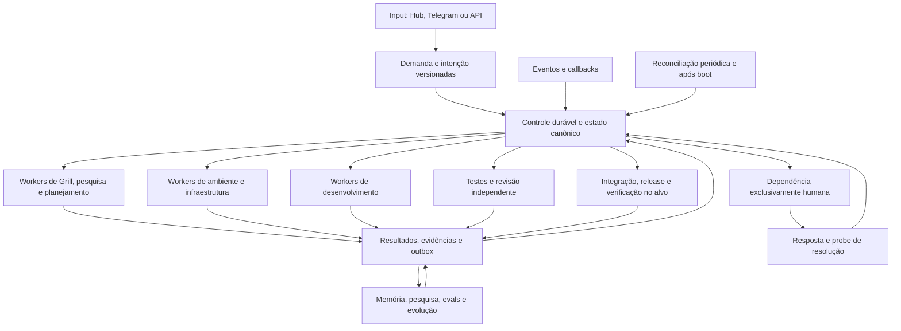

# Dark Factory: revisão arquitetural da autonomia contínua

Data: 18/09/2026. Baseline local: `83e5298eb231599076811802dceac8575c7f6feb`, em `C:\dev\DarkFac`, sem alterações locais reportadas pelo Git no início e no fim da inspeção.

**Veredito: `changes_required` para a promessa de autonomia contínua.** Há uma base reutilizável substancial. As lacunas principais estão na composição operacional: entrada obrigatoriamente ligada à execução, autoridade única sobre o trabalho, consumidores permanentes, retomada automática e evidência real de entrega. Não recomendo reescrever a fábrica. Também não seria correto prometer que basta instalar alguns cron jobs.

Esta revisão avalia responsabilidades, interfaces, entradas executáveis, contratos e evidências. A leitura pontual das entradas dos serviços serviu para conferir o comportamento arquitetural declarado; não foi feita auditoria geral de código. Não foram executados testes, chamadas pagas, provisionamento, deploy, mudanças de política ou comandos operacionais. O estado atual dos processos na VPS, dos serviços externos e das contas não foi sondado. Portanto, os achados sobre a composição versionada são concretos; a equivalência entre esse checkout e o que está instalado nos hosts permanece por verificar.

## 1. O resultado que precisa ser garantido

Uma demanda aceita deve entrar em trabalho durável e avançar, sem novos comandos humanos, por Grill, pesquisa, planejamento, infraestrutura, implementação, validação, revisão, integração, release e verificação operacional. O pipeline pode ramificar: infraestrutura e desenvolvimento podem avançar em paralelo quando seus contratos permitirem; pesquisa e aprendizagem devem acompanhar o trabalho.

A propriedade central é: **se existe trabalho elegível, autorizado e com capacidade disponível, ele deve ser despachado dentro de um prazo verificável, mesmo após reinício ou perda de evento.**

Isso contém duas garantias diferentes:

- Correção: um trabalho sem dependências, autorização ou evidência suficientes não avança indevidamente.
- Progresso: um trabalho que pode avançar não permanece parado esperando que o owner digite “continue”.

A fábrica deve ficar permanentemente disponível. Não precisa consumir LLM quando não há trabalho útil. Ociosidade, espera por capacidade e retry temporário são estados operacionais legítimos; precisam ter motivo, próximo despertar e recuperação. Esgotamento de tentativas deve gerar diagnóstico/replanejamento, não uma espera humana genérica nem repetição infinita da mesma falha.

## 2. O que já existe e deve ser preservado

| Responsabilidade | Peças existentes | Reutilização recomendada |
|---|---|---|
| Projetos e backlog | `ProjectRegistry`, `DemandsStore`, projeção de roadmap | Descobrir todos os projetos e reconciliar demandas com trabalho executável. |
| Entrada e esclarecimento | `IntegratedIntakeService`, Grill, adapters de contratos | Produzir intenção versionada e decisões com origem. |
| Prontidão | `WorkflowHandoff`, `ReadinessGate`, `VerificationContext`, manifestos e evidências | Manter os gates na fronteira de despacho e conclusão. |
| Execução local durável | `WorkflowRuntime` e runtime DF-11 | Reusar semântica de jobs, outbox, leases, dependências e recuperação; preservar execução local. |
| Controle cloud | ADR DBOS/PostgreSQL, coordenador, worker e compose | Completar o caminho operacional escolhido, sem nova competição de frameworks nesta etapa. |
| Capacidade e custo | HF-07/HF-11, `PortfolioScheduler`, orçamento e roteador HF-23 | Usar políticas de escolha e limites sob uma autoridade de reserva. |
| Desenvolvimento e qualidade | `AgentExecutor`, `ImplementationCycleService`, harness, revisão e worker remoto de testes | Transformar interfaces existentes em consumidores reais de jobs. |
| Entrega | reconciliação GitHub, pipeline de release, webhook Dokploy, backup | Conectar efeitos externos e retorno de evidências ao estado canônico. |
| Memória e evolução | `PersistentMemoryService`, pesquisa, Learning Pack, `FactoryEvolutionEngine`, catálogo | Acionar por eventos duráveis e avaliar melhorias antes da promoção. |
| Interação | DarkHub, Telegram e n8n | Entrada, notificações e decisões; interfaces do controle, sem uma segunda fila independente. |

O registro de projetos local contém DarkFac, ATRIUM (`site-ggcampos`), Segundo Cérebro e Jarvis. A elegibilidade deve usar os IDs canônicos desse registro. Nomes de exibição e aliases não devem criar filas ou orçamentos distintos para o mesmo projeto.

## 3. Achados e relação causal com o sintoma

### A1 — O requisito de autonomia já existe; falta fechar sua execução

**Comprovado documentalmente.** `HYBRID_AUTONOMY_REQUIREMENTS.md`, seção 5, já exige outbox transacional, consumidor idempotente, reconciliação, paralelismo, retomada e ausência de espera por prompt. As metas já registradas são despacho em até 30 segundos com capacidade livre e reconciliação em até 60 segundos.

O handoff HF-05, porém, libera apenas HF-05-01 local. Ele declara que o runtime não chama rede, shell, modelo ou UI e deixa a integração externa para HF-05-02. A abertura de `core/workflow/runtime.py` preserva explicitamente essa fronteira.

**Implicação:** um runtime capaz de registrar trabalho não assegura que alguém o execute. Não é necessário escrever outra declaração de autonomia; é necessário fechar os consumidores e sucessores que o desenho já exige.

### A2 — As entradas cloud versionadas não constituem um serviço contínuo

**Comprovado nas entradas executáveis examinadas.** O compose inicia `core.orchestrator.cloud_coordinator` e `core.orchestrator.cloud_worker`. Seus `main()` consultam status, imprimem o resultado e retornam. O coordenador confere disponibilidade do módulo DBOS e do banco; essa consulta não demonstra lançamento de um motor consumindo workflows. Não há nesse caminho um loop permanente de consumo e reconciliação.

A política de restart do container pode reiniciar esse comando, mas repetir um diagnóstico não cria um consumidor de tickets. O startup do Hub examinado atualiza benchmarks e então atende HTTP; também não inicia o despachante do workflow.

**Limite:** isso não prova que inexista uma automação externa instalada manualmente na VPS. Prova que o manifesto e as entradas versionadas examinadas não materializam a continuidade anunciada.

### A3 — Entrada de demanda e criação de trabalho durável são separáveis

**Comprovado na interface pública examinada.** `IntegratedIntakeService.receive_demand()` recebe `runtime=None` e só registra run/job se houver runtime. A CLI `intake` chama esse serviço sem fornecê-lo. A criação comum de tickets persiste no `DemandsStore`; o caminho do Hub examinado usa essa criação.

**Implicação:** “ticket criado” ou um identificador de run exibido não assegura que um job tenha sido colocado na fila. Isso explica por que uma demanda pode aparecer no painel e ainda depender de alguém iniciar a etapa seguinte.

O contrato precisa tornar a inscrição na esteira obrigatória em modo autônomo, preservando um modo explicitamente documental quando desejado. Falta de runtime deve produzir estado recuperável visível, nunca uma aceitação operacional silenciosa.

### A4 — Há mecanismos de agenda e estado sem uma composição operacional única demonstrada

**Comprovado quanto às superfícies; inferência quanto ao efeito global.** Coexistem runtime DF-11, `WorkflowRuntime` HF-05 em SQLite, coordenador cloud projetado para DBOS e `PortfolioScheduler` HF-23 com estado JSON. No conjunto `core/`, `hub/` e `scripts/`, as buscas de consumidores de `claim_next` e `pending_events` não localizaram um despachante de produção usando essas primitivas; o scheduler de portfólio aparece em sua CLI.

O mesmo padrão aparece em aprendizagem: há serviços de memória, avaliação e promoção, além de CLI/API, mas não foi encontrada a cadeia contínua de consumo de eventos que os conecte a cada etapa de produção.

**Implicação:** boas políticas locais não se tornam automaticamente uma fila global. Acrescentar um cron diferente por módulo, cada um decidindo e reservando estado isoladamente, ampliaria a dificuldade de controlar duplicação e concorrência.

### A5 — Entrega modelada e entrega observada ainda se confundem

**Comprovado no contrato do pipeline examinado.** `ReleasePipelineService` constrói registros de build/release e recebe `preflight_passed` e `smoke_passed` como entradas, inclusive com defaults positivos. Isso não constitui execução e observação independentes do deploy real. O digest ali construído vincula metadados; por si só não demonstra o digest de um pacote efetivamente construído e instalado.

Existe um cliente de webhook Dokploy em `hub/backend/webhooks.py`; portanto, não se deve afirmar que a fábrica não tem mecanismo algum de deploy. A lacuna é demonstrar a composição: **artefato construído → operação remota identificada → término observado → artefato instalado conferido → jornada executada → evidência consumida pelo gate**.

Autonomizar um registro de sucesso sem fechar essa cadeia apenas automatizaria uma conclusão insuficiente.

### A6 — Os ensaios disponíveis não comprovam a promessa integral

**Comprovado nos artefatos.** Os três relatórios HF-15 encontrados têm `PASS`, mas declaram SQLite sandbox, endpoint n8n em modo sandbox e concorrência sintética. O relatório `hf15_e06ad9161a` registra essas limitações explicitamente. Isso é evidência de um recorte controlado, não de continuidade em infraestrutura real com notebook desligado.

O script de ativação ATRIUM/Jarvis da baseline atual exercita componentes úteis, mas também usa aprovação simulada e uma amostra HTML local. Uma chamada real ao Segundo Cérebro nesse script não transforma os demais passos em um ensaio da fábrica completa.

**Implicação:** a confiança de “ciclo encerrado” excede o que as evidências consultadas demonstram. A aceitação final precisa medir o comportamento que hoje depende de você.

### A7 — A autoridade sobre avanços ainda admite interpretações conflitantes

**Comprovado documentalmente.** `HANDOFF_POLICY.md` diz que aprovação de plano por modelo qualificado é diferente de aceite humano e proíbe inventar aprovação humana por ticket. A skill canônica de adoção ainda traz nível 2 com merge manual como padrão. `AUTONOMY_POLICY.md` define revisão manual para classe C e produção fora da automação na classe D; documentos HF posteriores contemplam produção automatizada dentro de condições, preservando aceite de cliente pagante.

**Implicação:** um executor pode parar por uma leitura conservadora de regras divergentes. A correção deve publicar precedência e uma política efetiva por projeto. O pedido atual define a intenção de autonomia; esta revisão não altera os envelopes existentes nem autoriza novas compras ou publicação externa.

### A8 — Escolher um modelo não garante haver executor habilitado

**Comprovado na separação das interfaces.** O roteador de portfólio retorna uma decisão de modelo; isso não demonstra uma sessão de agente capaz de usar ferramentas, editar, testar e retomar no host escolhido. Há também suposições de disponibilidade em sua consulta de saldo e tabelas fixas de modelos, que não substituem capacidade observada.

As regras HF pedem qualificação por papel e conta/host. Assinatura disponível na sessão interativa não comprova acesso autônomo no worker. O fallback local deve preservar a qualificação exigida: pode executar trabalho compatível, mas não receber automaticamente uma decisão arquitetural acima de sua capacidade apenas porque custa zero.

## 4. Arquitetura mínima recomendada

Cada módulo é um papel independente, com sua fila lógica, capacidade e concorrência. Isso não exige um servidor separado para cada skill. Um conjunto pequeno de processos pode hospedar vários papéis. O controle decide o que está pronto; as LLMs interpretam, planejam, implementam e analisam dentro do trabalho concedido. Evidências e política governam as transições.

Reusar a decisão DBOS/PostgreSQL para o controle cloud, condicionada à prova operacional faltante. Preservar SQLite local e os contratos existentes. Não converter automaticamente checkpoints de um runtime em outro, nem permitir que dois runtimes sejam donos do mesmo job. O HF-23 fornece priorização e política de capacidade; a reserva efetiva deve ocorrer na mesma autoridade que concede a lease do job.

### Contrato mínimo por etapa

Os nomes abaixo são uma proposta de composição, não APIs já existentes:

| Campo | Garantia necessária |
|---|---|
| Identidade | Projeto, demanda, ticket, run, etapa e versão do plano sem ambiguidade. |
| Elegibilidade | Dependências por etapa, autorização, qualificação, recursos e evidência exigida naquele ponto. |
| Executor | Handler real, skill versionada, conta/host, ferramentas e capacidade comprovada. |
| Reserva | Job, lease com fencing, locks e orçamento concedidos de forma consistente. |
| Resultado | Referências verificáveis a artefatos, estado externo e evidência; texto da LLM não aprova o próprio trabalho. |
| Sucessor | Transição e evento persistidos juntos; consumidor idempotente materializa o próximo job. |
| Recuperação | Timeout, heartbeat, retry/backoff, retomada por checkpoint e consulta ao efeito externo antes de repetir. |
| Escalonamento | Correção ao desenvolvedor; lacuna de contrato ao planejador; acesso/intenção exclusiva ao humano. |

Não prometer exactly-once de efeitos externos. Usar processamento repetível, chaves de operação e reconciliação do resultado remoto quando houver dúvida após uma queda. A chave de deduplicação deve incluir a identidade e versão relevantes; uma resposta antiga não pode liberar um plano ou artefato novo.

O reconciliador deve descobrir trabalho por estado, além de consumir eventos: demandas sem job, planos desatualizados, dependências resolvidas, jobs prontos sem lease, leases expiradas, callbacks ausentes e jobs de aprendizagem não criados. Evento é o caminho rápido; varredura é a recuperação do mesmo controle.

## 5. Sete intervenções delimitadas

Rótulos A–G identificam propostas desta avaliação; não são tickets já abertos ou aprovados no backlog.

| Ajuste | Prioridade e escopo | Componentes reaproveitados | Aceite cirúrgico |
|---|---|---|---|
| **A. Autoridade efetiva por projeto** | P0, pequeno no desenho; resolver precedência entre regras e definir operações previamente autorizadas. | Políticas HF, classes de risco, adoção e perfis de projeto. | Ticket técnico autorizado avança sem confirmação extra; ação fora do envelope abre somente a dependência afetada. |
| **B. Entrada e fila canônicas** | P0, integração média; demanda aceita gera intenção durável de execução, com recuperação de backlog existente. | Registry, DemandsStore, contratos e outbox HF-05. | Criar demanda pelo Hub, CLI ou canal configurado resulta em job recuperável; repetir entrada não duplica efeito. |
| **C. Supervisor e workers permanentes** | P0, integração média; completar HF-05-02/controle cloud e vincular os handlers. | Coordenador/worker HF-03, runtime HF-05, políticas HF-23, executores e worker de testes. | Com capacidade, jobs avançam sem prompts; reinício e perda de evento recuperam trabalho; lease velha não confirma resultado. |
| **D. Planejamento contínuo e recursos qualificados** | P1, integração média; varrer portfólio, decompor, replanejar e escolher rota executável. | HF-07/08/09, handoffs, router, orçamento, pesquisa e catálogo. | Todo item planejável tem trabalho de planejamento; toda folha pronta tem contrato suficiente; indisponibilidade de uma conta não bloqueia os demais jobs. |
| **E. Fechar o ciclo de infraestrutura e release** | P0 para alegar entrega, integração média ou maior conforme os adapters reais disponíveis. | Manifestos, ManualDependency, GitHub, release, Dokploy e backup. | Mesmo artefato observado no destino; jornada real passa; falha aciona recuperação verificável; resposta humana dispara probe e retomada. |
| **F. Consumidores de aprendizagem e pesquisa** | P1, integração pequena a média; ligar eventos a coleta, avaliação e promoção. | HF-10/25 e skills 00/08/10/11/12/13/14. | Falha ou entrega gera evidência e trabalho de aprendizagem; regra avaliada chega a um job futuro; restart preserva memória; pack não bloqueia produção. |
| **G. Aceitação operacional e painel de progresso** | P0, transversal; reformular a prova HF-15 e exibir estagnação real. | HF-13/15, telemetry, gates e observabilidade existentes. | O ensaio abaixo passa no caminho público, com processo externo observando progresso, e falha quando o consumidor é desligado. |

**Ordem sugerida:** A e o desenho dos oráculos G; depois B/C com uma fatia vertical mínima; D/E para fechar uma demanda real; F e os demais cenários G. Definir desde o começo os eventos de aprendizagem de todos os módulos, evitando uma integração posterior incompatível. O fechamento só ocorre quando F e G estiverem exercitados.

Não é necessário concluir uma nova onda de funcionalidades de produto. A primeira fatia deve ser estreita: uma demanda clara, um plano, uma implementação, validação, integração e uma release isolada real. Em seguida, comprovar ramificações, recuperação e portfólio. Tamanho de integração não deve ser mascarado como “um ajuste de cron”; cada bloco deve ser dividido por fronteira verificável antes da implementação econômica.

## 6. Comportamento dos agentes por papel

| Papel | Busca trabalho quando | Produz e encaminha | Espera legítima |
|---|---|---|---|
| Grill | Demanda nova ou decisão material invalidada | Intenção esclarecida → planejamento; perguntas apenas da decisão afetada. | Conhecimento/intenção exclusivos do owner. |
| Planejador | Ticket sem especificação, plano invalidado ou `needs_replan` | Plano versionado, filhos, dependências, aceites e aprovação por identidade qualificada. | Decisão material ainda pendente ou ausência temporária de rota qualificada. |
| Infraestrutura | Manifesto incompleto ou probe inválido para a etapa | Configuração autorizada, evidência por identidade/rota ou dependência manual guiada. | Acesso ou ação externa que só o usuário pode fornecer. |
| Desenvolvedor | Folha aprovada e dependências satisfeitas | Candidato em worktree, evidências locais → validação. | Replanejamento, recurso ou dependência concreta. |
| Verificador/revisor | Candidato e critérios vinculados disponíveis | Aceite, correção específica ou retorno de arquitetura. | Ambiente exigido indisponível, com recuperação registrada. |
| Integrador/release | Candidato validado e política satisfeita | PR/merge reconciliados, artefato, deploy, smoke real, recuperação. | Aceite de cliente quando aplicável ou permissão ainda não concedida. |
| Pesquisa/aprendizagem | Questão aberta, falha, entrega, descoberta ou revisão vencida | Fontes, conclusões, candidatos avaliados, memória e pack. | Dependência específica de pesquisa; jamais leitura obrigatória do pack. |

“100% planejado” precisa significar pronto para o escopo conhecido, com critérios de parada. Não significa expandir detalhes indefinidamente. Proponho manter os estados já previstos de `design_specified`, `waiting_dependency`, `needs_architecture_binding` e `ready_for_handoff`. Contratos estáveis podem ser especificados antes da infraestrutura; os vínculos que realmente dependem dela ficam explícitos. Evidência de produção não deve ser exigida circularmente para iniciar o código que a produzirá.

Uma alteração relevante invalida somente os planos dependentes daquele contrato. Um novo SHA sem alteração pertinente não deve forçar replanejamento de toda a carteira.

## 7. Esperas, autonomia e ajuda ao usuário

Separar produto, job e serviço evita transformar uma falha local em parada da fábrica:

| Situação | Encaminhamento automático |
|---|---|
| Erro transitório, rede ou limite temporário | Retry agendado, backoff e rota alternativa compatível. |
| Repetição sem progresso | Diagnóstico e job de replanejamento; não pedir “posso continuar?”. |
| Cota de uma assinatura esgotada | Avaliar outras contas/hosts, APIs autorizadas e tarefas locais qualificadas. |
| Teto autorizado atingido | Respeitar o teto; seguir com trabalho elegível sem gasto adicional. Saldo e autorização são coisas distintas. |
| Nenhuma rota compatível agora | Espera com motivo, reset/próxima sondagem; outros trabalhos continuam. |
| Segredo, consentimento ou decisão exclusivos | `ManualDependency` vinculada aos descendentes afetados. |
| Resposta “já fiz” | Executar o probe correto; só evidência válida resolve a dependência. |
| Nenhum job elegível | Supervisor disponível, timers de manutenção e próximo despertar; não criar trabalho fictício. |
| Falha do próprio controle | Recuperação/alerta operacional; nunca representar pane como ociosidade saudável. |

Uma dependência manual deve conter passos atuais, local exato, valores sugeridos para campos não secretos, resultado esperado por passo, canal seguro para segredo, alternativas já tentadas, probe final e retomada automática. Os guias concretos são produzidos quando uma dependência real for descoberta; esta revisão não inventa configurações que o usuário precise fazer agora.

Não remover indiscriminadamente todos os gates humanos. Publicar conteúdo externo, aceitar uma entrega comercial ou ampliar gastos pode ter uma política específica. O ajuste é resolver a autorização uma vez no escopo adequado e reutilizá-la, em vez de pedir autorização administrativa a cada etapa técnica.

## 8. Pesquisa e autoaperfeiçoamento sem uma nova barreira global

Cada etapa carrega contexto relevante antes de trabalhar e persiste resultado/aprendizado ao concluir ou falhar. O evento alimenta duas trilhas: sucessor produtivo e aprendizagem. Só uma descoberta que invalide um requisito, contrato ou garantia do trabalho dependente deve bloquear essa continuação.

Fluxo proposto: evento → observação com proveniência → hipótese de melhoria → avaliação independente → promoção versionada → aplicação em jobs futuros → medição de regressão → rollback quando necessário.

Pesquisa fundamental para uma decisão é dependência daquele planejamento. Pesquisa exploratória e atualização do catálogo usam capacidade e orçamento próprios, sem monopolizar a fábrica. Dedupe por evento/questão/versão impede que o aprendiz aprenda repetidamente sua própria notificação e produza um ciclo infinito. Alterar o verificador do próprio candidato continua proibido.

O Learning Pack é saída de documentação. Falha de geração tem retry; falta de leitura não interrompe entrega. Modelo e política permanecem fixados por job; novas versões qualificadas entram nos jobs seguintes.

## 9. Prova mínima de autonomia real

Executar em ambientes e projetos isolados autorizados, usando as interfaces públicas que o usuário e os workers realmente utilizam. Um observador externo ao executor registra evidências; o script do ensaio não pode chamar manualmente cada fase e contabilizar isso como despacho autônomo.

1. **Demanda clara:** um único input gera plano, implementação, testes, revisão, integração, release e jornada no alvo, sem mensagens “continue”.
2. **Grill seletivo:** uma pergunta material bloqueia só os descendentes afetados; demanda de outro projeto chega à entrega enquanto se aguarda.
3. **Portfólio:** todos os projetos registrados com trabalho elegível progridem; o planejador não termina após o primeiro ticket; planos prontos liberam desenvolvimento sem esperar o restante da carteira.
4. **Correção:** falha funcional cria reparo; lacuna arquitetural retorna ao planejador; nova versão volta à execução automaticamente.
5. **Evento perdido/duplicado:** excluir a notificação de teste ou reenviá-la não perde trabalho nem duplica efeito; reconciliação recupera a intenção.
6. **Queda e reinício:** encerrar worker/coordenador em pontos definidos recupera jobs e reservas; owner de lease vencida não confirma resultado; desligar o notebook não interrompe trabalho cloud elegível.
7. **Recursos e orçamento:** indisponibilizar uma rota real de teste causa fallback qualificado; esgotar todas as rotas pagas mantém tarefas locais elegíveis; ausência total gera espera explicável com reavaliação automática.
8. **Dependência humana:** resposta incorreta falha no probe; correção verificada libera os tickets sem edição manual de workflow.
9. **Release real:** confirmar operação remota e digest instalado; executar escrita/leitura ou jornada equivalente; injetar falha e observar rollback/recuperação no alvo, não apenas um recibo interno.
10. **Aprendizagem:** um evento produz candidato; um caso independente rejeita melhoria ruim; uma melhoria válida é recuperada por job posterior após restart; o pack permanece opcional.
11. **Observabilidade:** com job elegível e capacidade livre, ausência de despacho ultrapassando a meta é defeito visível. Desligar o consumidor deve reprovar o ensaio, mesmo que o endpoint de saúde continue respondendo.

Usar as metas já documentadas de 30 s/60 s, medidas sob condições declaradas. Acrescentar uma janela proposta de observação de 24 h com chegadas de novas demandas e reinício controlado. Essa janela demonstra o cenário exercitado, não prova disponibilidade infinita nem capacidade de nove jobs pesados na VPS. Concorrência é condicionada à capacidade medida.

O painel deve mostrar: idade do job elegível mais antigo, último despacho/reconciliação, heartbeat por worker, leases e reservas, quantidade pronta/em execução/bloqueada, causa da espera, próxima reavaliação e prova de entrega. A métrica mais direta do problema relatado é **quantidade de impulsos manuais exigidos após o input inicial**, separando decisões humanas legítimas de comandos administrativos.

## 10. Referências locais e limites da conclusão

Referências principais, todas consultadas nesta avaliação:

- [Requisitos de continuidade e recuperação](C:/dev/DarkFac/docs/HYBRID_AUTONOMY_REQUIREMENTS.md:56).
- [Política de handoff e aprovação pelo planejador](C:/dev/DarkFac/docs/HANDOFF_POLICY.md:58).
- [Handoff HF-05 e sucessor de integração cloud](C:/dev/DarkFac/docs/handoffs/HF-05.md).
- [Runtime local e fronteira declarada](C:/dev/DarkFac/core/workflow/runtime.py:1).
- [Entrada do coordenador](C:/dev/DarkFac/core/orchestrator/cloud_coordinator.py:110) e [entrada do worker](C:/dev/DarkFac/core/orchestrator/cloud_worker.py:134).
- [Manifesto cloud](C:/dev/DarkFac/deploy/dokploy/docker-compose.cloud.yml).
- [Intake com runtime opcional](C:/dev/DarkFac/core/demands/integrated_service.py:84) e [chamada da CLI](C:/dev/DarkFac/core/demands/cli.py:275).
- [Criação de tickets](C:/dev/DarkFac/core/demands/service.py:64) e [startup do Hub](C:/dev/DarkFac/hub/backend/main.py:130).
- [Scheduler de portfólio](C:/dev/DarkFac/core/portfolio/scheduler.py:40) e [HF-23](C:/dev/DarkFac/docs/handoffs/HF-23.md).
- [Roteamento e disponibilidade](C:/dev/DarkFac/core/portfolio/router_optimizer.py:70).
- [Contrato de staging](C:/dev/DarkFac/core/orchestrator/release_pipeline.py:233), [produção](C:/dev/DarkFac/core/orchestrator/release_pipeline.py:314) e [cliente Dokploy existente](C:/dev/DarkFac/hub/backend/webhooks.py:289).
- [Política anterior de autonomia](C:/dev/DarkFac/docs/AUTONOMY_POLICY.md:7) e [padrão de adoção](C:/dev/DarkFac/.agents/skills/07-build-dark-factory/SKILL.md:54).
- [Exigências do HF-15](C:/dev/DarkFac/docs/handoffs/HF-15.md), [relatório sandbox](C:/dev/DarkFac/.factory/reports/hf-15-hf15_e06ad9161a/report.json:61) e [ativação com aprovação simulada](C:/dev/DarkFac/scripts/run_practical_activations.py:124).
- [Memória](C:/dev/DarkFac/core/learning/service.py:49), [evolução](C:/dev/DarkFac/core/evolution/engine.py:39) e [HF-25](C:/dev/DarkFac/docs/handoffs/HF-25.md).

**Avaliação de proximidade:** estamos perto quanto ao catálogo de capacidades e ao desenho pretendido. Ainda falta um marco de integração operacional substancial. A arquitetura não demanda reinvenção; demanda fechar os caminhos acima e certificar progresso autônomo no ambiente real. Sem essa prova, “todos os módulos concluídos” continua sendo uma medida diferente de “a fábrica funciona sozinha”.
