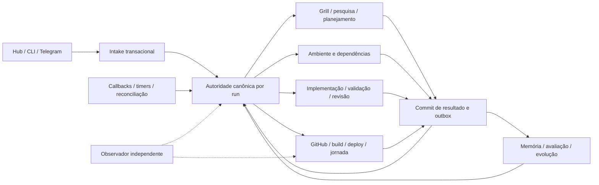

# Composição da autonomia contínua — plano de implementação

Versão 1.0 · 18/09/2026 · origem `user-demand` · pacote `HF-26-PLAN`.

**Entrega: planejamento e handoff. Nenhuma implantação ou autonomia operacional é certificada aqui.**
O marco HF-26 compõe capacidades existentes; não reabre como não implementados os módulos HF-01–25.
O [índice executável](handoffs/continuous-autonomy/INDEX.md) e o
[DAG estruturado](../.factory/planning/continuous-autonomy/plan.json) são normativos para os subtickets.

## Origem, baseline e autoridade

Intenção e Grill herdados da tarefa `01a0b49f-68a7-7af0-9367-113ecd1b14c1`;
planejamento na tarefa `01a0b4c8-f4a3-7dc2-b9c0-a0d9945333c9`. A revisão arquitetural
de 18/09 foi lida integralmente; sua cópia com hash integra este pacote.
Baseline local limpa: `83e5298eb231599076811802dceac8575c7f6feb`, Python 3.12.10,
pytest 9.1.1, Windows. Branch isolada `codex/continuous-autonomy-plan`.
O remoto observado em 18/09 era `00133f6093d0b78090b04deacc61c82dcee5abb7`, **sete
commits atrás** da baseline. Esses commits incluem HF-21–25 e ativação ATRIUM/Jarvis.
Eles não são parte desta entrega documental nem prova de integração remota. O binding
de baseline HF-26-03 deve reconciliá-los antes de depender de sua disponibilidade no servidor.

Identidade disponível: Codex, modelo da família GPT-6 conforme contexto do executor,
papel de planejamento. O identificador exato da variante, esforço efetivo e atestado
de qualificação do host não são expostos por este ambiente. O catálogo da ferramenta
lista `gpt-6-astra`, mas isso não autentica o modelo desta chamada. Cota Codex observada:
40% restante na janela de 5 h e 51% semanal; sem créditos adicionais. Fotografia local,
sem equivalência com assinatura executável na VPS. Não houve chamada paga nem delegação.

O plano tem revisão adversarial pelo próprio autor, identificada como tal.
Não emitimos recibo fictício de revisão independente nem aprovação de PR.
`ready_for_handoff` no índice significa contrato tecnicamente resolvido, para admissão
do coordenador. O despacho exige `PlanApproval` real no `VerificationContext`, papel
qualificado e preflight. O [primeiro contrato tipado](../.factory/planning/continuous-autonomy/initial-handoff.json)
pode ser validado hoje; a ausência de contexto confiável deve reprovar o gate, sem
pedir aprovação técnica adicional ao owner. Essa admissão é trabalho do supervisor.

## Grill e decisões encerradas

1. Autonomia cobre toda a cadeia e todos os projetos registrados; não termina no primeiro
   plano ou na primeira entrega. Fonte: demanda original. Alternativa rejeitada: acionamento manual por módulo.
2. Owner decide intenção, permissões não concedidas, segredos e aceite comercial obrigatório.
   Escolhas técnicas e ordem pertencem ao planejador. Fonte: demanda e HANDOFF_POLICY.
3. Reusar SQLite local e ADR DBOS/PostgreSQL cloud. Não escolher novo framework nem converter checkpoints.
   Fonte: revisão e ADR-HF-001. Evidência DBOS operacional continua pendente.
4. Pesquisa, memória e evolução são partes do marco de aceitação; Learning Pack é saída opcional de leitura.
   Fonte: demanda. Alternativa rejeitada: adiar aprendizado para depois da autonomia.
5. Orçamento e permissões existentes persistem. Não comprar crédito, contratar infraestrutura
   ou transformar números históricos em autorização. Fonte: demanda e HYBRID_AUTONOMY_REQUIREMENTS.
6. Hipóteses técnicas reversíveis: heartbeat 10 s, lease 45 s, varredura 30 s, espera ociosa
   máxima 15 s com wakeup por evento; devem satisfazer despacho <=30 s e reconciliação <=60 s
   sob capacidade declarada. Não alteram limites financeiros nem prometem capacidade não medida.

Não há pergunta material exclusiva do owner para produzir este plano. Há bindings técnicos
e probes externos ainda necessários; falha de probe não equivale automaticamente a dependência humana.

## Requisito → achado → unidade → oráculo

| Requisito | Achado revalidado | Unidades | Resultado observável |
| --- | --- | --- | --- |
| Sem aprovação técnica por ticket | HF handoff e política C/D divergem | HF-26-01/02 | Política efetiva avança operação autorizada; rejeita ampliação e preserva cliente |
| Toda demanda vira trabalho durável | receive_demand runtime opcional; JSON e fila separados | HF-08-01/02/03 | Input público confirmado só após commit de demanda+run+job+outbox; crash não perde intenção |
| Consumidores permanentes | main cloud imprime status e sai | HF-05-02/03/04/05/06 | PID estável, DBOS lançado, handlers reais, kill e recuperação observados |
| Reserva única | HF-23 JSON separado das leases HF-05 | HF-23-01 | Dois workers nunca gastam a mesma reserva nem confirmam com fencing antigo |
| Planejar todo escopo conhecido | Serviços existem sem consumidor contínuo | HF-08-04, HF-07-01/02 | Todos os projetos varridos; folhas liberadas sem esperar carteira completa |
| Implementar, corrigir e revisar | AgentExecutor/cycle existentes, binding real pendente | HF-09-01/02 | Agente usa ferramentas e produz candidato; verificador distinto reprova defeito |
| Infra/setup e retomada | Manifestos/probes existem sem composição | HF-03-07, HF-08-05 | Manifesto observado pelo worker; resposta incorreta não resolve dependência |
| Integração e deploy real | Pipeline aceita booleanos; webhook Dokploy existe | HF-11-01, HF-12-01/02/03/04 | PR/SHA, bytes construídos, operação remota, digest instalado, jornada e rollback reais |
| Memória/pesquisa/evolução | Serviços/CLI/API sem cadeia de consumo | HF-10-01/02, HF-25-01 | Evento gera candidato avaliado; job após restart aplica versão promovida; ruim é rejeitada |
| Provar progresso | HF-15 sandbox; relatório não prova operação | HF-13-01/02, HF-15-01/02 | Observador detecta pronto parado mesmo com health 200; ensaio público sem fases manuais |
| Não confundir local e integrado | main remoto sete commits atrás | HF-26-03 | Inventário de SHAs alcançáveis e contratos compatíveis, sem publicar herança incidental |

## Composição final e fronteiras

`ProjectRegistry` é autoridade de identidade (`darkfac`, `site-ggcampos`, `segundo-cerebro`,
`jarvis` na baseline), não uma fila. Aliases resolvem antes de construir chaves. Novos projetos
registrados entram na próxima varredura; projetos pausados continuam inventariados sem despacho.

O store de controle persiste identidade, demanda/intenção, revisões, jobs, resultados,
dependências, operações externas, outbox, reservas e leases. **Um run tem um `runtime_owner`
imutável** (`hf05_sqlite`, `df11_legacy` ou `cloud_dbos_postgres`). DF-11 e runs HF-05 existentes
continuam no seu owner; não se espelham como jobs novos. HF-05 local preserva API e invariantes.
Para a composição nova, HF-05-02 fixa schema e fronteira DBOS usando a versão realmente instalada;
HF-05-03 materializa storage cloud. Não se permite inferir API DBOS a partir da importação.

DBOS cuida de execução/espera durável no cloud; as tabelas de aplicação em PostgreSQL
são autoridade de elegibilidade e reserva. Disparo DBOS usa outbox e workflow ID determinístico;
queda entre commit e enqueue é reconciliável. Nunca se prometem duas transações atômicas
entre o store e a engine. A aplicação concede lease uma única vez; a fila DBOS é transporte
recuperável e não um segundo concedente de recursos.

HF-23 fornece seleção justa e limites, deixando de conceder slots em JSON no modo composto.
Implementação não lê arquivos de budget como autorização se o store canônico não tem a
mesma revisão. Claims reservam recursos e custo na mesma transação da lease.

`DemandsStore` torna-se projeção compatível para entradas autônomas; o JSON existente é
importado com cursor/fingerprint e sem efeitos duplicados. Modo documental fica explícito.
`IntegratedIntakeService` delega recepção transacional; não executa Grill LLM dentro da transação.

`AgentExecutor` e `ImplementationCycleService` permanecem serviços de execução e gates,
não são scheduler. `ReleasePipelineService` passa a consumir resultados observados e perde
o poder de declarar release operacional com `preflight_passed=True`/`smoke_passed=True` do chamador.
`DokployDeployClient` é reutilizado atrás de domínio headless após sanitização; webhook 2xx
é somente aceite de solicitação, nunca término ou digest instalado.

Memória e evolução recebem eventos pelo mesmo controle, em pools distintos com orçamento
próprio. Pesquisa necessária é dependência da decisão pertinente; exploração não bloqueia
o portfólio. DarkHub/Telegram/n8n são canais e projeções. Não ganham fila independente.

## Protocolo implementável do controle

As APIs abaixo são **novas**, a criar nos arquivos declarados nos handoffs; não são métodos
já disponíveis. Modelos novos usam Pydantic v2, `extra=forbid`, UTC e IDs de projeto canônicos.
O [contrato compartilhado](handoffs/continuous-autonomy/CONTRACTS.md) fixa tipos, erros e exemplos.

1. `accept(command, now) -> IntakeReceipt`: chave única `(project_id, channel, external_id)`;
   payload canonicalizado+hash; replay igual retorna o recibo original, hash diferente gera conflito.
   A mesma transação grava demand revision, owner de run, job Grill e outbox. Commit falhou:
   HTTP 503/CLI não zero e nenhum recibo de aceitação. Documental: `run_id=null`, status explícito.
2. `claim(worker, capabilities, now) -> Claim | None`: checa dependências/evidências, política,
   pausa/cancelamento, versão de handler, rota qualificada e custo. Bloqueia linhas de orçamento,
   slots e conflitos numa ordem estável; incrementa fencing e reserva atomicamente. Custo
   desconhecido exige bound autorizado, não zero. SQLite local usa transação exclusiva curta;
   PostgreSQL usa locks transacionais conforme binding. Não chamar LLM sob lock.
3. `heartbeat(claim, now)`: apenas owner/fencing corrente renova lease. `finish(claim, result)`
   verifica prazo, owner, plano/build/config e recibos confiáveis; grava resultado, gasto observado,
   liberação de reserva, estado e outbox na mesma transação. Confirmação tardia é rejeitada.
4. `materialize(event)` insere sucessores com chave `(run,ticket,plan_version,stage,iteration)`;
   consumer inbox/evento e criação de jobs na mesma transação. Ack apenas depois. `finish`
   não precisa da entrega do evento para o reconciliador inferir o mesmo sucessor do resultado.
5. `reconcile(now, cursor, limit=100)` lê todos os projetos por paginação estável e grava cursor.
   Corrige demanda sem job, sucessor ausente, dependência resolvida, ready sem lease, lease
   expirada, callback ausente, contexto/pesquisa pendentes e catálogo vencido. Cursor não pode
   ignorar entradas novas menores: cada ciclo completo recomeça, com watermark auditável.
   Terminar uma página nunca significa terminar a carteira.

Registry de handlers: chave `(stage, handler_version)`, callable `handle(StageContext)->StageResult`,
com input/output schema, papel, limites, permissões e probe de qualificação. Stage desconhecida
vira `needs_architecture_binding`, nunca success vazio. `StageContext` contém claim, plano,
manifesto, contexto de memória fixado e referências de evidência, sem segredos em payload.
Cada efeito usa ledger com `operation_key`, `request_digest`, `external_id`, `state`.
Timeout após envio fica `unknown`; reconciliar consulta externa antes de reenviar. Se o provedor
não permite correlação inequívoca, bloquear esse efeito e devolver binding, não duplicar.

Sucessores: intake→grill→research_required/planning→environment/design leaves→development→validation
→independent_review→integration→build→staging→production_authorized→target_journey→delivered.
Correção funcional cria nova iteração de desenvolvimento (máximo duas por causa); mudança de
contrato cria planning/rebind, sem laço automático ilimitado. Todos os resultados/falhas geram
memory_observation; research/eval/promotion são jobs deduplicados separados. Gates de cada fase
usam evidência dessa fase: não exigir deploy futuro para admitir implementação.

Espera humana bloqueia nós/descendentes, não o run inteiro quando há ramos independentes.
Como o runtime atual tem WAITING_HUMAN no run, o binding precisa persistir estado de dependência
por job e derivar resumo do run; não reutilizar transição global que impeça irmãos elegíveis.

Retry: I/O transitório 3 tentativas com 5/20/60 s e jitter limitado; após limite,
diagnóstico/replanejamento único por causa+versão. Correção de implementação: duas tentativas
focais sem progresso. Lease 45 s, heartbeat 10 s; tempo do job é separado da lease renovável.
Relógio do store é autoridade para expiração; duração usa relógio monotônico. Cancelamento e
pausa são verificados antes de claim e de cada efeito. Graceful shutdown até 30 s; após isso
não concluir lease; recuperação do próximo worker. Sem busy loop, chamada LLM ociosa ou
sucessão infinita de jobs de RCA sobre o mesmo incidente.

## Roadmap, estados e execução

A fonte já consumida `.factory/roadmap/darkfac.json` recebe HF-26 e todos os novos subtickets.
Não se adicionam subtickets às tabelas regex do plano HF: elas só aceitam `HF-NN` e truncam
dependências com sufixos. O JSON admite IDs completos e mantém o DAG. HF-05-02 é reutilizado
como sucessor já reservado; HF-26 é marco de composição, sem novo framework.

Projeção de status atual: novos itens ficam `planned`, com `state_rationale` e tags para
prontidão do plano. O JSON do planejamento distingue `design_specified`, `waiting_dependency`,
`needs_architecture_binding`, `ready_for_handoff`, `implementation_status` e
`operational_status`. Nenhum novo item tem evidence_ref de conclusão.
HF-13-01/02 corrigem a projeção rica e a autoridade da evidência; até lá documento atualizado
e snapshot local não certificam painel em produção atualizado. Relatórios deste planejamento
ficam fora do glob de conclusão `hf-*-report.md`.

Caminho crítico: HF-26-01→02→HF-05-02→03→HF-08-01→02→03 e HF-05-04→05→06;
convergem com HF-07/HF-09, integração HF-11 e release HF-12; aprendizagem HF-10/HF-25 e
observador HF-15 são obrigatórios antes de ativação/aceite. O DAG JSON lista arestas exatas.
Sem promessa de duração antes de capacidade e dependências externas observadas.

Após HF-26-01: política 02 e reconciliação de baseline 03 podem avançar sem esperar cloud.
Após contratos do controle: intake, handlers, rotas e oráculos podem ser desenvolvidos em
worktrees diferentes. Ownership de cada arquivo é exclusivo; arquivos compartilhados
exigem serialização mesmo quando não há aresta funcional. Binding pode dividir unidade
que exceda quatro arquivos principais; não autoriza ampliar livremente o escopo econômico.

Primeiro ticket: **HF-26-01**, resolvedor puro de política, dois arquivos novos, sem rede,
sem segredo e sem mutação de política ativa. Papel econômico qualificado após admissão pelo
supervisor de alta inteligência. Contrato e exemplos detalhados no handoff individual.
Depois de validação/revisão/integração, evento de conclusão libera HF-26-02 e HF-26-03.
Não se solicita ao owner escolher a ordem técnica.

## Ativação progressiva

1. **Preflight/binding HF-03-07:** inventariar host, SHA/imagem, PostgreSQL/DBOS reais,
   identidades, DNS/TLS, acesso GitHub, slots, custos, backup e secret refs. Reconciliar
   repositórios/volumes do host; caminhos Windows no registry não são mounts Linux.
   Tentativas automáticas dentro do envelope precedem qualquer ManualDependency.
2. **Controle isolado:** banco/namespace autorizado, schema versionado, restore testado,
   instalação por imagem imutável. Lançar serviços reais, readiness exige heartbeat,
   último reconcile e handler executado, não apenas import/connect. Sem tráfego de produto.
3. **Fatia vertical mínima:** uma demanda de alteração pequena em alvo isolado, submetida
   uma única vez pelo caminho público; plano, código, testes, PR, merge, build, deploy,
   jornada e memória com observador. Não alimentar outputs das fases manualmente.
4. **Restart/rollback:** matar worker após efeito remoto e antes de recibo; observar lookup
   e convergência. Atualizar versão drenando owners antigos. Reverter imagem preserva
   schema backward-compatible e runs fixados; não copiar checkpoint cloud para SQLite.
   Banco indisponível deixa runs cloud em espera técnica e só novos runs autorizados podem
   escolher runtime local; nunca reassumir a mesma execução em outro owner.
5. **Expansão:** portfólio completo registrado com namespaces e tetos existentes. ATRIUM
   usa target `hostinger_ftp`, outros `local_service`: não substituí-los por Dokploy por
   conveniência. Binding de release deve gerar contratos por target; indisponibilidade
   de target local com notebook desligado bloqueia só jobs que o exigem.
6. **Janela 24 h HF-15-02:** chegadas novas, pausa/cancelamento, perda de evento, bloqueio
   seletivo, fallback e aprendizado após restart. Só emitir `operationally_verified`
   quando todas as linhas do protocolo de aceitação tiverem evidência atual; ausências
   ficam explicitamente não exercitadas. O marco não é entregue com apenas a fatia feliz.

Implantação é uma fase futura: nenhum segredo/serviço foi sondado remotamente aqui.
Não há dependência humana de configuração detectada nesta sessão, portanto não há guia
inventado. Quando detectada, HF-08-05 prepara instruções na UI atual, todos os campos e
seletores, sugestões não secretas, canal seguro, alternativas tentadas, probe e retomada.

## Aceitação independente no caminho público

O observador roda como identidade/processo separado, fora da worktree do executor e com
permissão de leitura de estado/eventos e probes de alvo. O candidato não altera seu verificador.
O controlador injeta somente demandas, respostas humanas de teste e falhas previamente
autorizadas; nunca chama cada fase para criar progresso artificial. Relógios correlacionados,
configuração/capacidade e períodos de indisponibilidade registrados antes de medir 30/60 s.

| Caso | Ação pública/falha | Oráculo externo e contraprova |
| --- | --- | --- |
| V01 | Uma demanda clara | Jornada no alvo + digest + SHA + zero impulsos administrativos; parar consumidor deve falhar |
| V02 | Grill pendente no projeto A, B elegível | B entrega; nenhum descendente dependente de A avança |
| V03 | Backlog em todos os IDs registrados | Sweep completo e planejamento por escopo/version; alias não cria novo projeto |
| V04 | Defeito e lacuna arquitetural | Reparo/replanejamento com versão nova e retorno automático; sem relaxar oracle |
| V05 | Evento descartado e duplicado | Reconcile <=60 s, um efeito por chave; replay conflitante rejeitado |
| V06 | Kill worker/coordenador, notebook offline | Lease velha rejeitada, reserva reconciliada; trabalho cloud continua com cliente desconectado |
| V07 | Rota qualificada real indisponível | Outra assinatura/OpenRouter autorizado/local conforme piso; sem rota, próximo wakeup explícito |
| V08 | Resposta manual incorreta/depois correta | Probe pelo host/identidade certos reprova e depois libera só dependentes |
| V09 | Deploy e falha de jornada | Digest lido do alvo, escrita/leitura persistida; rollback e restore reais, RPO/RTO medidos |
| V10 | Evento de aprendizado e restart | Candidato ruim rejeitado por holdout; bom aplicado em job posterior, sem leitura de pack |
| V11 | Job pronto, slot livre, consumidor parado | Alerta de estagnação >30 s mesmo health 200; painel mostra causa e idade |
| V12 | Pausa/cancelamento ou aceite comercial ausente | Nenhum efeito indevido; retomada somente com autorização/aceite pertinente |
| V13 | 4 desenvolvimentos + 5 testes | Só com capacidade explicitamente suficiente; caso não exercitado não vira PASS |

Janela proposta: 24 horas contínuas, com contador de demandas, critérios por projeto,
latência máxima observada de despacho/reconcile, heartbeats, reservas, backlog pronto,
custos e prompts administrativos. Limite mede o cenário e a capacidade declarados;
não prova disponibilidade infinita ou capacidade de nove jobs pesados na VPS atual.

## Revisão, validação e integração

[Revisão adversarial e correções](handoffs/continuous-autonomy/REVIEW.md).
[Registro de execução e estado remoto](../.factory/planning/continuous-autonomy/validation.json).
Hashes de fontes e artefatos estão no manifesto de integridade, sem assinatura de aprovação.
Validação estrutural não substitui testes comportamentais nem o ensaio futuro.
O fluxo remoto publicará apenas o delta documental; os sete commits herdados exigem
reconciliação própria. Se gates/auth/política impedirem merge, a entrega fica publicada
pendente ou bloqueada, com a causa real registrada; não se inventa revisão independente.
