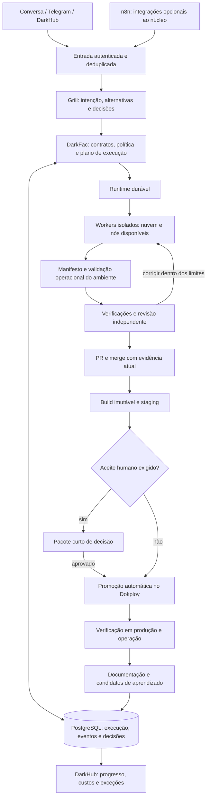

# Dark Factory — plano integrado de produção com workflow híbrido

Data: 08/09/2026. Revisão: 1.1, após revisão do owner. Status: proposta de desenvolvimento, informada pelas respostas do owner nesta sessão. Nenhuma instalação, migração ou alteração de comportamento foi executada por este documento. A escolha definitiva do runtime pertence ao HF-02.

Requisitos obrigatórios complementares: [autonomia, Grill, ambiente, modelos e paralelismo](HYBRID_AUTONOMY_REQUIREMENTS.md). A matriz desse documento especifica o impacto em cada módulo HF e os cenários adicionais G1–G8. Em caso de conflito com formulações anteriores deste plano, prevalecem esses requisitos revisados. A região Alemanha está oficializada. O owner confirmou Windows preservado com Linux via WSL2 e abandono da instalação Ubuntu/formatação do servidor. O inventário associa esse setup ao servidor local; conferir separadamente o sistema da VPS por preflight técnico. Nenhuma configuração de máquina é alterada por inferência.

## 1. Resultado esperado e decisões do owner

A fábrica recebe uma demanda por conversa, realiza o Grill eficiente de entendimento, produz uma especificação verificável, escolhe o fluxo apropriado e executa o ciclo de engenharia até a operação do produto. O owner participa da definição de intenção, de decisões que dependem exclusivamente de seu julgamento e do aceite estruturado. O sistema registra progresso e retoma trabalho sem depender de uma conversa aberta ou do notebook ligado.

O portfólio de referência contém três tipos de produto: ferramentas de engenharia semelhantes à própria DarkFac; um segundo cérebro; e um site empresarial com frontend, backend, CRM, conteúdo, blog, identidade visual, SEO, IA e integrações de marketing. O segundo cérebro é uma referência de complexidade; sua implementação não foi auditada nesta revisão. Cerca de dez projetos devem coexistir; isso não significa dez builds pesados simultâneos.

| Tema | Diretriz incorporada |
| --- | --- |
| Disponibilidade | Controle e capacidade mínima de execução em nuvem, independentes do notebook. O servidor local, disponível aproximadamente 80% do tempo, é capacidade adicional. |
| Custos | Poucas dezenas de dólares adicionais por mês nesta etapa. Propostas maiores exigem receita ou decisão de expansão. Não há autorização de contratação ilimitada. |
| IA | Scripts para tarefas determinísticas; modelos econômicos via rede; modelos maiores preferencialmente nas assinaturas existentes, quando houver adaptador compatível e cota. OpenRouter já integrado. |
| Interface | Owner acompanha pelo DarkHub, conversa com agentes e Telegram; os agentes mantêm os fluxos. Não exigir edição visual de nós. |
| GitHub | Push, PR, checks, revisão e merge automáticos no escopo autorizado. Falha de gate bloqueia; não exigir novo pedido para publicar uma entrega válida. |
| Produção inicial/interna | Após o aceite humano necessário, publicação automática. Mudanças que não exigem novo julgamento humano podem seguir a autorização vigente do projeto. |
| Cliente pagante | Quando o sistema já estiver em produção e aceito pelo cliente pagante, cada promoção a produção exige validação manual do owner. Staging e merge continuam automáticos. |
| Dados | Dados sensíveis são possíveis. Sem exigência inicial de processamento local; preservar isolamento, segredos, minimização e capacidade futura de políticas por cliente. |
| Operação | Tolerância a interrupções de horas em situações críticas; alta disponibilidade não é requisito inicial. |
| Piloto | Ainda não escolhido. A onda 1 encerra com ensaio real completo da fábrica em projeto de aceitação descartável; um projeto comercial vem depois. |

O owner confirmou PostgreSQL instalado, funcionando e testado no Dokploy. Reaproveitar a instância; verificar acesso pela identidade de execução antes de integração nova.

A qualidade é responsabilidade da fábrica: a entrega ao humano já precisa ter evidência automática suficiente. O aceite não transfere ao owner a obrigação de procurar erros técnicos. Nenhuma arquitetura, porém, permite presumir como comprovada a qualidade de um resultado ainda não verificado.

## 2. Avaliação da base e rastreabilidade

A revisão cobre missão, regras, arquitetura, playbook, roadmap operacional, plano DF, ADRs e roadmap de infraestrutura, catálogo de skills 00–17, registros de aprendizado e relatórios de implementação. Os relatórios são evidências históricas, não certificação do estado atual do remoto ou dos serviços. A leitura de código foi limitada ao monitor financeiro para interpretar o saldo solicitado; não houve auditoria geral nem execução de testes.

| Base | Evidência e limite relevante | Tratamento no novo ciclo |
| --- | --- | --- |
| DF-01–04 | Estados, guard e evidências de validação documentados. | Preservar contratos; verificar integração real e autoridade confiável. |
| DF-05–06, DF-17–19 | Separação de métricas, avaliação e promoção de aprendizado documentadas. | Reaproveitar; conectar resultados de produção e contexto por projeto. |
| DF-07–09, DF-16 | Proteção do Hub, transporte e portabilidade documentados. | Revalidar fronteiras ao expor o Hub central e introduzir workers remotos. |
| DF-10–14 | Persistência, recuperação local, orçamento, executor e providers. | Adaptar para operação central, sem reescrever domínio e controles. |
| DF-15 | Vertical de bugfix com checkpoints; exemplo restrito. | Generalizar para projeto novo e evolução de aplicação existente. |
| DF-20 | Política e adaptador GitHub somente leitura; não realiza push, PR, merge ou deploy. | Complementar com execução e reconciliação remotas. |
| DF-21 | Painel somente leitura. | Evoluir para comandos autenticados, aprovações e acompanhamento. |
| DF-22 | Conteúdo e visual usam contratos comuns de providers/orçamento. | Acionar apenas quando o produto requer conteúdo ou imagem. |
| DF-23 | Relatório entrega protocolo e espelho de skills, explicitamente sem automação funcional. | Registrar cobertura parcial e implementar ownership/worktrees no executor. |
| RM-01–09 | Roadmap como projeção de fontes; histórico RM-09 limitado à vida do serviço. | Preservar projeção; integrar HF e INFRA, sem converter o painel em segunda fonte de verdade. |
| INFRA-01–07 | Inventário declara nós, VPS, Dokploy e PostgreSQL entregues. | Confirmar serviço/configuração/versionamento antes do rollout. |
| INFRA-08–11 | A leitura inicial apontava itens planejados; fontes posteriores relatam INFRA-09/USR-18 e INFRA-10/USR-16 entregues. Relatos não substituem validação operacional. | Tornar dependências da onda 1; não duplicar com outros IDs. |

Fontes locais principais: [plano DF](DEVELOPMENT_PLAN_2026-09-05.md), [roadmap RM](ROADMAP_OPERACIONAL.md), [runtime DF-11](RUNTIME_DECISION.md), [política DF-20](AUTONOMY_POLICY.md), [relatório DF-23](../.factory/reports/df-23-worktree-protocol-report.md), [roadmap INFRA](../.factory/infra/roadmap.md).

### Observações diretas nesta sessão

- DarkHub local acessível em 08/09/2026. O cartão OpenRouter exibia saldo de **US$ 8,59** e **US$ 1,41** sob o rótulo de gasto mensal. Saldo disponível, limite da chave e orçamento autorizado da fábrica são grandezas distintas.
- A leitura focal do monitor mostrou uso do campo `usage` como gasto mensal; a documentação oficial diferencia `usage` acumulado e `usage_monthly`. O valor mensal deve ser reconciliado no HF-07. Não usar esse rótulo como limite de execução nem alterar faturamento nesta fase. [OpenRouter — limites](https://openrouter.ai/docs/api_reference/limits).
- O cartão n8n marca ativo, mas aponta para `https://n8n.io`, sem identificar instância ou instalação. O Dokploy foi acessado e apresentou login; a instalação remota de n8n permanece **não confirmada**, não declarada ausente. A busca documental não localizou um manifesto de instalação específico.
- O painel de tarefas exibiu **“Fila indisponível: HTTP 404”**. Registrar incompatibilidade de serviço/interface como pendência do HF-01; a causa não foi depurada.
- Decisão oficial do owner: VPS na Alemanha; inventário registra CX23 com 2 vCPU/4 GB/40 GB em Falkenstein. A referência anterior a Ashburn/CPX21 fica superada. O inventário associa Windows/Docker Desktop/WSL2 ao servidor local; o owner confirmou que a instalação Ubuntu foi abandonada para preservar o servidor Windows usando WSL2. Essa decisão substitui o guia histórico para o servidor local. O sistema efetivo da VPS será verificado tecnicamente, sem reinstalação ou formatação.
- Existem mudanças locais de outras frentes. Este planejamento não as integra, reverte nem declara entregues.

As afirmações antigas de custo zero absoluto, eliminação de viés, segurança inviolável e impossibilidade de perda de dados precisam de revisão editorial. A arquitetura deve comunicar garantias delimitadas e evidências observadas.

## 3. Decisão arquitetural da primeira onda

### Separação de responsabilidades

O núcleo DarkFac continua responsável por política, escopo, risco, orçamento e aceite. Uma biblioteca ou motor durável executa a sequência e persiste seu progresso. Agentes raciocinam e produzem candidatos dentro de etapas. Integrações recebem eventos e entregam resultados. Dokploy publica os artefatos liberados.

### Comparação orientada às restrições atuais

| Alternativa | Adequação | Limitação que precisa entrar na decisão | Encaminhamento |
| --- | --- | --- | --- |
| Supervisor atual + evolução do store | Maior reaproveitamento e boa operação offline. | A equipe fica responsável por ampliar e manter recuperação, espera, versionamento e coordenação. | Baseline de comparação e modo local preservado. |
| **DBOS Python + PostgreSQL** | Biblioteca de execução durável; combina com Python e banco existente. | Recuperação entre processos/hosts e atualização de workflows têm requisitos específicos; não assumir serviços gerenciados gratuitos. | **Candidato preferencial para o spike HF-02.** |
| Temporal self-hosted | Histórico/replay, atividades e workflows duráveis. | Serviço adicional, esquema e operação próprios; custo total precisa ser medido. | Alternativa se a opção leve não atender aos cenários essenciais. |
| Prefect self-hosted | SDK Python, servidor, estado, filas e observação operacional. | Mais uma camada de servidor/UI; sem presumir equivalência exata de recuperação e efeitos externos. | Comparação documental; spike apenas se superar as duas opções iniciais. |
| LangGraph | Composição e persistência de ciclos agênticos. | Não resolve sozinho autorização, sandbox, GitHub, release e operação da fábrica. | Adaptador interno futuro, se houver necessidade comprovada. |
| n8n Community | Integrações prontas, webhooks e automações mantidas por agentes. | Git/environments e outros recursos não integram a edição gratuita consultada; duplicar estado do SDLC gera drift. | Instância simples para integrações; sem autoridade final sobre gates. |

Fundamento factual: [DBOS — arquitetura](https://docs.dbos.dev/architecture), [DBOS — workflows](https://docs.dbos.dev/python/tutorials/workflow-tutorial), [Temporal — deployment](https://docs.temporal.io/self-hosted-guide/deployment), [Prefect — servidor](https://docs.prefect.io/v3/concepts/server), [LangGraph — persistência](https://docs.langchain.com/oss/python/langgraph/persistence), [n8n — edições](https://docs.n8n.io/deploy/host-n8n/community-edition-features). A preferência por DBOS é uma inferência de engenharia para este cenário, não resultado de benchmark já executado.

O HF-02 compara primeiro DBOS e o runtime atual na mesma sequência curta. Deve demonstrar queda entre etapas, espera humana persistente, evento repetido, versão antiga ainda em execução, cancelamento e efeito externo com resposta perdida. Medir memória, recuperação, manutenção necessária e esforço de integração. Se nenhum passar, avaliar Temporal; evitar implementar três plataformas completas.

Critérios de seleção: correção de recuperação e efeitos 30%; simplicidade operacional/custo 25%; reaproveitamento e portabilidade 20%; versionamento/auditoria 15%; integração e saída do fornecedor 10%. Falha essencial desclassifica independentemente da pontuação. Versões, licenças e disponibilidade devem ser verificadas no spike. A decisão gera ADR com migração e rollback antes de habilitar o runtime novo.

### Topologia recomendada para validar

- Um coordenador ativo em nuvem, reiniciado automaticamente pelo gerenciador de serviço, com PostgreSQL persistente. Não depender de coordenadores simultâneos ou Conductor gerenciado para o requisito inicial.
- Workers de agentes executam jobs isolados; acessam API de tarefas e recebem credenciais limitadas, sem acesso amplo ao banco de controle. Um worker não confiável não pode escrever checkpoints do supervisor nem autorizar releases.
- Notebook e servidor local são workers oportunísticos. Sua ausência remove capacidade, não perde a fila. Reservar capacidade de execução em nuvem para progresso quando ambos estiverem indisponíveis.
- Builds e execução de código de agentes devem ter host/ambiente separado do banco e das credenciais de produção. Uma segunda VPS pequena para execução é candidata de infraestrutura mandatória se o isolamento existente não atender. Não montar o socket administrativo do Docker em jobs de agentes.
- Preservar os clientes atuais em Dokploy/PostgreSQL; banco e usuário separados por projeto. Controle da fábrica em banco lógico próprio. Isolamento lógico não é alta disponibilidade nem isolamento físico.
- Artefatos grandes e logs ficam em armazenamento de objetos; banco guarda referências e hashes. R2 em nuvem é a cópia externa disponível quando o servidor local estiver desligado.
- O runtime local SQLite continua opcional para desenvolvimento e clone limpo. Uma execução tem um único runtime proprietário; não sincronizar bancos SQLite por pasta compartilhada nem ter dois supervisores avançando o mesmo run.

## 4. Contrato comum das etapas

### Regra permanente de autoria do plano e execução

**Toda unidade de desenvolvimento deve passar por planejamento de um modelo de alta inteligência e handoff pronto para modelo econômico implementar e testar, inclusive tarefas simples, scripts, skills e mudanças na fábrica.** Aplicar [HANDOFF_POLICY.md](HANDOFF_POLICY.md). HF-04 implementará contrato e gate de prontidão; HF-06 adaptará as skills; HF-07 fará o roteamento obrigatório de papéis. A revisão de alta inteligência resolve decisões e lacunas; o implementador econômico não reduz critérios nem troca arquitetura. Até esses módulos existirem, o coordenador aplica a regra no PIV atual.

Handoffs detalhados disponíveis: [HF-01](handoffs/HF-01.md) e [HF-02](handoffs/HF-02.md). São planos condicionados ao preflight/dependências, não implementações concluídas. HF-02 termina com decisão arquitetural de alta inteligência baseada em medições produzidas pelos executores econômicos.

Cada etapa vira um módulo versionado com uma ficha legível e contrato validável. A skill descreve como o agente trabalha naquele módulo; não decide por conta própria quais etapas são obrigatórias.

| Dimensão | Conteúdo exigido |
| --- | --- |
| Identidade | Projeto, demanda, run, etapa e versões de workflow, contrato, skill, política e executor. |
| Inputs | Objetivo, critérios, referências de artefatos, fatos necessários, permissões e orçamento reservado. |
| Acionamento | Pré-condições, dependências, risco, complexidade, tipo de produto e justificativa de execução ou dispensa. |
| Ações | Operações determinísticas permitidas; trabalho agêntico delimitado; ferramentas e destinos autorizados. |
| Outputs | Artefato tipado, proveniência, alterações, medições, conclusões e referências de evidência. |
| Aceitação | Verificador responsável, candidato/artefato avaliado, política aplicada e motivos de reprovação. |
| Falha e retomada | Timeout, retries limitados, classificação de erro, checkpoint, reconciliação e eventual compensação. |
| Interação humana | Pergunta concreta, opções, recomendação, evidências, identidade e objeto exato da decisão. |

Resultados mínimos: `waiting_budget`, `waiting_dependency`, `retry_scheduled`, `succeeded`, `failed`, `retryable`, `waiting_human`, `waiting_capacity`, `blocked_policy`, `cancelled` e `skipped_by_policy`. Dispensa nunca significa aprovação fictícia. Um evento de sucesso textual do modelo não altera o estado oficial.

O fluxo de alto nível usa estados de produto — recepção, Grill, especificação, planejamento, execução, verificação, integração, staging, aceite, release, operação — com tentativas subordinadas. Os nomes atuais de DF-01 serão mapeados, não substituídos silenciosamente. `MERGED`, `DEPLOYED` e `ACCEPTED` representam fatos diferentes.

Determinismo significa repetir as decisões de controle dadas as mesmas versões, entradas e saídas registradas. Inferência, relógio, rede e ferramentas continuam não determinísticos e ficam dentro das etapas com resultados persistidos. Para efeitos externos, exigir idempotência e reconciliação: não prometer execução única universal. [DBOS — determinismo](https://docs.dbos.dev/python/tutorials/workflow-tutorial).

## 5. Fluxo de produção end to end

| Etapa | Inputs e acionamento | Ações | Outputs e condição de avanço |
| --- | --- | --- | --- |
| 1. Recepção | Conversa, mensagem, issue ou áudio; sempre. | Autenticar owner, identificar projeto, deduplicar; transcrever apenas se necessário. | Demanda rastreável, origem, anexos e dúvidas reais. |
| 2. Grill | Demanda, contexto e decisões conhecidas. | Alta inteligência esclarece lacunas materiais com opções e exemplos; reutiliza respostas; evita perguntas técnicas substituíveis. | GrillRecord pronto para especificar; pendência humana bloqueia só o que depende dela. |
| 3. Especificação | Demanda e contexto do negócio. | Agente estrutura jornada, funcionalidades, exclusões, marca, dados, integrações e critérios; agrupa decisões humanas. | Especificação versionada e acordo sobre intenção; ambiguidade material resolvida. |
| 4. Triagem | Especificação e política do projeto. | Separar complexidade, risco, incerteza, custo e ambiente; determinar módulos aplicáveis. | Plano de execução com justificativa de cada etapa e limite global. |
| 5. Pesquisa/reúso | Incerteza técnica, dependência nova ou falta de solução conhecida. | Consultar fontes e componentes; checar manutenção/licença; reutilizar pesquisa válida. | Decisões fundamentadas; dispensa registrada se conhecimento existente basta. |
| 6. Produto/arquitetura | Especificação, pesquisa, infraestrutura e padrões. | Definir arquitetura, jornada/UI, dados, requisitos operacionais e ameaças; fatiar dependências. | PRD, ADRs, contratos e backlog; owner só resolve escolhas de negócio que faltam. |
| 7. Provisionamento | Manifesto do projeto e plano. | Criar repositório, ambientes, storage, CI e configurações; validar acesso a integrações. | Projeto executável em ambiente isolado; chaves ausentes geram tarefa humana precisa. |
| 8. Preparação | Ticket pronto, baseline e capacidade. | Selecionar executor/modelo, contexto e orçamento; reservar worktree/ownership; verificar ambiente. | Job reproduzível, lease e manifesto de contexto. |
| 9. Implementação | Job e critérios. | Agente implementa unidade, testes pertinentes e documentação; scripts fazem operações mecânicas. | Candidato versionado e inventário de mudanças. |
| 10. Prontidão de ambiente | Candidato e manifesto de dependências. | Declarar/reconciliar ferramentas, chaves, rede e identidades; testar no worker/destino; tentar alternativa equivalente antes de pedir ação humana. | EnvironmentEvidence; dependência manual inevitável com passos e retomada automática; integração externa realisticamente validada. |
| 11. Verificação | Candidato e critérios independentes. | Estático, unitário, integração, jornada, navegador quando há UI, segurança e desempenho aplicáveis. | Evidência vinculada ao candidato; falha volta para correção dentro do teto. |
| 12. Revisão crítica | Diff, critérios, evidências e histórico relevante. | Revisor independente avalia correção, escopo, segurança e manutenção; resolve achados materiais. | Revisão estruturada atual; mudança posterior invalida evidências afetadas. |
| 13. Integração | Candidato aprovado. | Push, PR, checks remotos e merge; reconciliar timeout/resposta perdida e base atual. | PR integrada e SHA remoto observado; nenhum pedido adicional de publicação. |
| 14. Build e staging | Commit integrado. | Construir artefato identificável, inventariar dependências e publicar staging; verificar migrações e jornada. | Release candidate com digest, URL, evidências e plano de recuperação. |
| 15. Aceite humano | Somente critérios subjetivos/negociais ou release protegido. | Entregar resumo, previews e escolhas; pedir teste manual apenas do que a automação não pode decidir. | Aceite/rejeição/ajuste vinculado ao release, com identidade e data. |
| 16. Produção | Candidato de staging e política de aceite satisfeita. | Promover mesmo artefato, aplicar migração autorizada, executar smoke e observar saúde. | Deployment confirmado ou recuperação/rollback; API retornar 200 não basta. |
| 17. Operação/documentação | Release e telemetria. | Atualizar docs de uso/código, runbooks e decisões; monitorar serviço, backups, custos e falhas. | Produto operável, alertas úteis e trilha de entrega completa. |
| 18. Aprendizado | Resultado real, correções, incidentes e avaliações. | Registrar fatos, propor regra, avaliar em tarefas distintas e ativar/reverter sob política. | Memória selecionável e melhoria medida; erros não viram regras globais automaticamente. |

Documentação é produzida durante a execução e consolidada na entrega. Deve cobrir instalação, arquitetura/ADRs, funcionalidades, APIs, integrações, releases, operação, migrações, decisões e erros. Não exigir comentários que apenas repitam o código.

### Perfis de execução

| Perfil | Disparo | Profundidade |
| --- | --- | --- |
| Simples | Mudança pequena, conhecida e reversível. | Especificação curta, contexto focal, uma implementação e revisão proporcional; sem pesquisa ampla ou torneio. |
| Padrão | Feature empresarial de escopo delimitado. | Planejamento, integração/UI quando aplicável, revisão independente, staging e documentação. |
| Complexo | Projeto novo, arquitetura, múltiplas integrações ou alta incerteza. | Descoberta, arquitetura, decomposição e revisões adicionais; concorrência limitada e controlada. |
| Sensível | Autenticação, dados, migrations, credenciais ou governança. | Controles reforçados, recuperação e verificador protegido; humano somente quando há decisão exclusiva ou exigência de política. |
| Incidente | Regressão ou serviço degradado. | Diagnóstico e mitigação priorizados, escopo restrito, correção, pós-incidente e aprendizado. |

Risco prevalece sobre conveniência: uma mudança de uma linha pode exigir controles fortes. O LLM pode sugerir a classe; fatos como caminhos de autenticação, migração e ambiente protegido impedem rebaixamento indevido. Duas tentativas focais sem progresso sobre a mesma causa devolvem o diagnóstico ao planejador de alta inteligência, que revisa a estratégia e devolve o handoff ao executor econômico. Não encerrar toda a fábrica por uma falha local; transporte, solução e orçamento têm estados distintos. Aplicar a política de recuperação e continuidade do documento complementar.

## 6. Revisão das skills, scripts e agentes

| Skills | Revisão a ser feita pelos agentes |
| --- | --- |
| 00 e 08 — aprendizado/evolução | Substituir cadência por prompt por gatilhos de evidência, recorrência e revisão periódica; separar evento, preferência explícita, hipótese e política ativa. |
| 01 — reconhecimento | Entrada: identidade/base do projeto. Saída: mapa incremental e referências; evitar releitura integral a cada tarefa. |
| 02 — planejamento | Executar Grill antes da especificação, produzir PRD/ADRs e handoffs concretos; alta inteligência resolve arquitetura e agrupa decisões exclusivas do owner. |
| 03 — roteamento | Resolver capacidade real do adaptador, disponibilidade do host, cota, custo e qualidade mínima; remover nomes fixos como autoridade. |
| 04 — PIV | Executar contrato de etapa; ownership, heartbeat e handoff automáticos; stop/resume preservam identidade. |
| 05 e 17 — validação | Scripts executam e resumem deterministicamente; IA interpreta falhas quando agrega valor. Não chamar LLM apenas para iniciar um comando. |
| 06 — revisão | Revisor independente, achados estruturados, evidência e resolução. Diversidade de modelo é um recurso, sem promessa de eliminar viés. |
| 07 — bootstrap | Instalação repetível por manifesto, dry-run, validação e rollback; nenhum setup manual recorrente por projeto. |
| 09 — áudio | Adaptador opcional de entrada; ausência da GPU não bloqueia demandas textuais. |
| 10 e 11 — pesquisa/reúso | Disparo por incerteza/novidade, fontes com links canônicos, ledger, resumos/insights/aprendizados, validade e reúso de resultados; evitar pesquisa obrigatória sem propósito. |
| 12 e 14 — benchmark/corridas | Atualização diária de releases/capacidades e Pareto em segundo plano; modelo fixado por job; experimentos separados de produção, teto próprio e comparação por tarefa aceita. |
| 13 — Learning Pack | Learning Pack persistente com aprendizados e tópicos de discussão no marco relevante; leitura e aprofundamento opcionais, sem interromper a cadeia de entrega. |
| 15 e 16 — conteúdo/visual | Carregar por necessidade; saída ligada a critérios de marca/qualidade e contratos comuns. |

Scripts devem cuidar de provisionar, reservar, despachar, coletar, reconciliar, publicar e restaurar. Skills orientam julgamento dentro dessas etapas. Versões canônicas e espelhos continuam sincronizadas; manter regras de precedência e verificação de drift. O plano não ativa agora nenhuma regra inferida nem modifica skills de outras frentes.

## 7. Política de aceite, merge e produção

Merge e deployment são decisões separadas. A política atual DF-20 contém restrições de classes C/D e não implementa efeitos remotos; o HF-11 vai compatibilizá-la com a autorização expressa nesta sessão, preservando controles específicos de risco. Não remover regras de proteção apenas para obter um merge verde.

| Situação | Merge / staging | Produção |
| --- | --- | --- |
| Produto novo com critérios subjetivos ainda sem aceite | Automáticos com evidências. | Esperar pacote de aceite; depois publicar automaticamente. |
| Projeto interno/experimental com intenção já aceita | Automáticos. | Automática se a mudança está dentro da política e os gates passaram. |
| Sistema já aceito por cliente pagante | Automáticos; staging não depende de aceite de produção. | Owner aprova cada release, seguido de deploy automático. |
| Reprovação técnica ou evidência desatualizada | Corrigir/revalidar. | Não promover. |
| Mudança de escopo, acesso ou compromisso fora da autorização | Preparar resultado concreto. | Solicitar apenas a decisão que falta. |

O pacote de aceite traz: o que mudou, o que já foi comprovado, preview/URL de staging, critérios que dependem do owner, opções com recomendação, riscos residuais concretos e consequência da escolha. Exemplo: **Aprovar e publicar / Solicitar ajustes / Adiar**, com comentários opcionais. Quando necessário, acrescentar duas ou três escolhas específicas de marca ou negócio. Meta: até cinco minutos por pacote comum, como alvo de produto, não promessa.

A aprovação é autenticada e vinculada a projeto, ambiente e digest da release. Um texto “aprovado” encontrado num documento não autoriza nada. Alteração material do candidato exige nova decisão; uma aprovação duplicada não causa segundo deploy. Silêncio não é aprovação. Reutilizar a decisão vigente dentro do escopo aprovado.

O GitHub oferece proteção de ambientes, com disponibilidade dependente de plano e visibilidade do repositório. Se os recursos necessários não estiverem disponíveis, o portão do serviço confiável de release valida a aprovação e detém exclusivamente as credenciais de produção. O implementador e o n8n não recebem essas credenciais. [GitHub — ambientes](https://docs.github.com/en/actions/how-tos/deploy/configure-and-manage-deployments/manage-environments).

Dokploy admite publicação por API/webhook. Para projetos protegidos, **não conectar push em main diretamente ao deploy de produção**: o adaptador promove somente o digest aprovado. A automação de staging pode continuar ligada ao merge. [Dokploy — auto deploy](https://docs.dokploy.com/docs/core/auto-deploy).

Rollback para a versão previamente aprovada será previsto como mitigação operacional autorizada por projeto; migração irreversível não se desfaz com simples rollback de container. Definir compatibilidade, backup e recuperação de dados antes da release. A fábrica pode desenvolver versões futuras de si mesma em ambiente candidato, mas não alterar sua própria autoridade ou verificador durante o run que está sendo avaliado.

## 8. Memória, observabilidade e operação

| Camada | Conteúdo | Uso |
| --- | --- | --- |
| Execução durável | Estados, eventos, tentativas, decisões, leases e efeitos externos. | Retomar e explicar cada execução. |
| Conhecimento do projeto | Especificações, ADRs, entidades, integrações, documentação e fatos aceitos. | Recuperar contexto pertinente com proveniência. |
| Aprendizado candidato | Falhas, hipóteses de prevenção, avaliação e aplicabilidade. | Melhorar políticas sem contaminar trabalho novo. |
| Preferências do owner | Instruções explícitas, escopo e validade. | Evitar reconfirmação e decisões repetidas. |

PostgreSQL para registros estruturados, Git para definições e documentação e armazenamento de objetos para artefatos volumosos. Começar com filtros por projeto/escopo e busca textual; índice vetorial só se a recuperação demonstrar necessidade. Logs não são automaticamente contexto. Referenciar evidências brutas, sem carregá-las inteiras a cada chamada.

Isolar memória entre clientes. Compartilhar somente padrões técnicos sanitizados e avaliados. Retenção inicial proposta: logs detalhados por 30 dias; evidências de releases e decisões por 180 dias; documentação vigente enquanto o projeto existir. Ajustar por custo e demanda. Retenção não apaga chaves de deduplicação de operações ainda sujeitas a replay; backup não substitui índice consultável.

Rastrear demanda → run → candidato → PR → build → ambiente → decisão → release → incidente. Expor tempo ativo/espera, tentativas, orçamento reservado/gasto, custo ausente, nó executor, testes/revisões e motivo de intervenção humana. Alertar por mudança acionável, não a cada heartbeat. Medir minutos de trabalho manual por projeto e por entrega.

Conectar INFRA-08 a restauração demonstrada de banco, artefatos, configuração do runtime e chave de criptografia do n8n. Proposta inicial: RPO até 24 horas para dados gerais e RTO até 4 horas, a validar com restauração real; não são SLA nem decisão já tomada pelo owner sobre perda tolerável de dados. Antes de armazenar dados insubstituíveis, confirmar esse objetivo ou reduzir o intervalo de backup. O servidor local recupera o atraso de cópias quando volta.

Saúde, espaço, certificado, backups, dependências e serviços externos geram alertas e tickets de manutenção. Segurança é proporcional ao produto, com referência ao [OWASP ASVS](https://owasp.org/www-project-application-security-verification-standard/). Vincular builds à origem e inventário de dependências; usar [SLSA](https://slsa.dev/spec/v1.2/) como referência de proveniência, sem declarar certificação ou nível não comprovado.

## 9. Roadmap integrado — duas ondas

IDs **HF** são uma extensão proposta e não substituem DF, RM, INFRA ou demandas USR. A integração nesta revisão é documental. O painel atual documenta fontes RM/DF; ingestão HF/INFRA e reconciliação dos estados serão entregas funcionais do HF-01/HF-13. Não marcar esta proposta como executada por existir um relatório.

### Onda 1 — decisão da ferramenta e fluxo híbrido operacional

| ID | Entrega de desenvolvimento | Depende de | Reúso / complemento | Critério de conclusão |
| --- | --- | --- | --- | --- |
| HF-01 | Baseline reconciliada de capacidades, versões e roadmaps; registrar cobertura parcial e pendências de integração. | — | DF/RM/INFRA; DF-21 e DF-23 | Uma matriz distingue planejado, implementado, integrado e operacional com fontes; HTTP 404 e n8n têm diagnóstico/pendência explícitos. |
| HF-02 | Spike, decisão do runtime e ADR de workflow híbrido; migração e reversão desenhadas. | HF-01 | DF-11 | Opção escolhida satisfaz cenários essenciais e custo operacional; alternativas e limites registrados. |
| HF-03 | Plano de instalação aplicado ao controle cloud, storage e worker cloud isolado; verificar/reaproveitar infraestrutura. | HF-02 | INFRA-05–07, DF-08/13 | Reinício recupera controle; execução mínima funciona com notebook e servidor local indisponíveis. |
| HF-04 | Contratos de etapas, Grill, ambiente/dependências manuais, manifesto de projeto, perfis e política determinística. | HF-02 | DF-01–04, DF-12 | Plano explica cada etapa executada/dispensada, rejeita transições ilegais e preserva versões. |
| HF-05 | Integração do runtime: eventos, jobs, espera, reconciliação, orçamento, ownership, gatilhos automáticos, paralelismo por etapa/projeto e cancelamento. | HF-03, HF-04 | DF-10–13, DF-23 | Interrupção e duplicação de mensagens não perdem estado nem causam avanço indevido; store único por run. |
| HF-06 | Modularizar catálogo 00–17, scripts de etapa e espelhos; remover gatilhos conflitantes. | HF-04 | Todas as skills | Catálogo completo aponta inputs, ações, outputs e política; nenhuma skill reduz os gates do supervisor. |
| HF-07 | Adaptadores efetivos de IA/execução, despacho por host/cota e orçamento financeiro reconciliado. | HF-03, HF-05 | DF-12–14/17, monitor de uso; INFRA-10 | Adaptadores demonstrados em execução real; ausência de assinatura remota usa fallback permitido; saldo/limite/mês são distintos. |
| HF-08 | Entrada de demandas, Grill, especificação e planejamento integrado; bootstrap de projeto novo. | HF-05, HF-06, HF-07 | Skills 01/02/07/09/10/11 | Conversa produz backlog, ambiente e critérios sem owner editar arquivos de fluxo. |
| HF-09 | Ciclo de implementação, qualidade e revisão independente por perfil. | HF-08 | DF-03/04/13/15/16/18/23 | Projeto novo e mudança em base existente geram candidatos verificáveis; falhas retornam ao loop limitado. |
| HF-10 | Memória persistente, autoaprendizado, pesquisa com fontes e Learning Pack do owner; documentação contínua. | HF-06, HF-09 | DF-06/18/19; skills 00/08/13 | Retomada recebe contexto seletivo; regra reprovada não ativa; dados de projetos não se misturam. |
| HF-11 | Executor GitHub de push/PR/checks/merge e reconciliação remota. | HF-09 | DF-20, protocolo de entrega | Entrega confirma estado/SHA remoto; checks antigos, timeout e replay não liberam candidato errado. |
| HF-12 | Build, staging, aceite, produção, smoke, rollback e backups exercitados. | HF-03, HF-11, INFRA-08, INFRA-09 | DF-20, Dokploy, política nova | Mesmo artefato é promovido; cliente pagante bloqueia produção sem aceite; restauração demonstrada. |
| HF-13 | DarkHub central: fila real, HF/INFRA, decisões, comandos autenticados e observabilidade. | HF-05 | DF-21, RM-01–09, INFRA-11 | Owner acompanha e decide sem editar ledgers; comandar e observar usam o mesmo estado canônico. |
| HF-14 | Telegram do owner e n8n Community simples, após verificar instalação existente. | HF-03, HF-05, HF-13 | Infraestrutura n8n cadastrada | Demanda e resposta retomam o run correto; reenvio é deduplicado; workflows mantidos/exportados pelos agentes. |
| HF-15 | Ensaio completo de aceitação e documentação de operação da fábrica. | HF-07, HF-09, HF-10, HF-12, HF-13, HF-14 | Evals existentes ampliados | Todos os cenários finais abaixo e G1–G8 do complemento demonstrados em fluxo real; limitações e custo registrados; owner só faz aceite exclusivo. |

Caminho principal: **HF-01 → HF-02 → HF-03/04 → HF-05 → HF-06/07 → HF-08 → HF-09 → HF-11 → HF-12 → HF-15**. HF-10, HF-13 e HF-14 convergem no mesmo gate final. INFRA-08/09 não podem ficar para a onda 2 porque a primeira onda já entrega produção. INFRA-10 amplia capacidade; HF-03 garante que sua indisponibilidade não paralisa tudo.

As linhas HF são pacotes de planejamento. HF-01 e HF-02 agora possuem tickets detalhados nos handoffs vinculados; os demais ainda exigem detalhamento por modelo de alta inteligência antes do despacho econômico. Cada unidade terá escopo, dependências, comandos existentes/aplicáveis e evidência esperada. Os comandos de testes novos nos handoffs só serão executáveis depois da implementação prevista; não repetir mudanças já comprovadas.

### Onda 2 — ampliar capacidades depois do fluxo operacional

Todos os itens dependem do HF-15; a prioridade final será guiada pelo primeiro projeto real e por métricas. Reusar bibliotecas/produtos maduros antes de desenvolver substitutos próprios.

| ID | Ampliação nova | Complemento ao existente | Critério de valor |
| --- | --- | --- | --- |
| HF-20 | Templates completos por arquétipo: ferramenta interna, segundo cérebro e presença empresarial. | Skill 07 e bootstrap HF-08 | Novo projeto começa com domínio, UI, dados e operação coerentes; não cria produto comercial sem demanda. |
| HF-21 | Pacote empresarial de marca, CMS/blog, CRM e SEO, com conectores de analytics/marketing/Google Ads. | Skills 15/16 e integrações n8n | Jornada lead → CRM e publicação mensurável; permissões e custos publicitários configurados por projeto. |
| HF-22 | Perfil de segundo cérebro: ingestão multimodal, busca, proveniência e avaliações de recuperação. | Áudio, pesquisa e memória existentes | Recuperar informação correta com fonte e acesso por projeto; importar conhecimento só sob escopo definido. |
| HF-23 | Eficiência de portfólio: priorização, capacidade, estimativas e experimentos de roteamento. | DF-05/12/17/18, skills 12/14 | Reduzir custo por entrega aceita e espera sem regressão; não apenas melhorar ranking de modelos. |
| HF-24 | Perfil enterprise sob demanda: isolamento reforçado, residência, identidade e recuperação mais rigorosa. | INFRA e políticas do HF | Ativado por exigência de cliente/receita, sem impor custo a todos os projetos. |
| HF-25 | Evolução autônoma da própria fábrica e catálogo reutilizável entre projetos. | DF-19 e HF-10 | Candidato avaliado em ambiente separado, promoção controlada e rollback; sem autoalteração do verificador ativo. |

A onda 1 já inclui segurança, operação, memória e documentação básicas. A onda 2 expande capacidades de produto e escala, não regulariza controles essenciais omitidos.

## 10. Instalações e tarefas exclusivas do owner

Cada interação humana será apresentada apenas quando os agentes tiverem preparado configurações, destinos, permissões e consequência. Não pedir ao owner que escreva YAML, monte grafos ou copie comandos repetidamente.

| Momento | Agentes preparam/executam | Owner faz somente quando necessário | Evidência de pronto |
| --- | --- | --- | --- |
| HF-02/03 | Comparar custo/capacidade, instalação repetível e plano de reversão. | Confirmar contratação/upgrade se necessário; autenticar conta quando não há acesso delegado. | Recursos provisionados dentro da decisão financeira. |
| HF-03 | Configurar rede privada, domínio, serviço central, banco e worker isolado. | Autorizar credenciais/permissões iniciais que a conta exige; guardar recuperação. | Serviço e worker acessíveis por interfaces previstas; segredos fora do Git. |
| HF-07 | Detectar adaptadores oficiais, cotas, limites e fallback. | Login/OAuth inicial ou inserção segura das chaves; definir limite que ainda não exista. | Chamada real pequena por adaptador; orçamento e consumo identificáveis. |
| INFRA-08/HF-12 | Automatizar backup, retenção e restauração; configurar buckets e jobs. | Fornecer acesso inicial ao R2 e custodiar chave de recuperação; decidir tolerância a perda quando material. | Restauração em destino isolado, inclusive de credenciais cifradas. |
| HF-11/12 | Configurar integração GitHub/Dokploy, staging e release protegido. | Instalar/autorizar GitHub App ou equivalente e conceder escopo específico. | PR automática e release obedecem às políticas. |
| HF-14 | Verificar instância, preparar n8n Community em Docker Compose/Dokploy, PostgreSQL próprio e proteção administrativa. | Login/criação inicial da conta administradora quando exigido pela interface. | URL real, versão, backup e workflow de exemplo; cadastro genérico corrigido. |
| HF-14 | Preparar bot e fluxos Telegram, pareamento e deduplicação. | Criar/autorizar bot via BotFather e fornecer token em campo seguro; iniciar conversa/confirmar pareamento. | Apenas owner autorizado envia comandos e aprovações. |
| HF-15 | Preparar release, preview e pacote de aceite. | Julgar somente aderência de negócio/experiência que depende de sua preferência. | Aceite registrado e publicação automática posterior. |

Para n8n, a opção proposta é **Community self-hosted**, em instalação única simples, sem cluster de filas ou plano pago no início. A documentação atual recomenda [Docker Compose](https://docs.n8n.io/deploy/host-n8n/install-options/install-using-docker-compose). Usar manifestos e exportações sanitizadas em Git, aplicação automatizada e backup da chave de criptografia; não depender do recurso nativo pago de ambientes/Git. A edição gratuita não substitui isolamento entre clientes; o uso inicial é interno, de um owner. Eventual oferta de n8n aos clientes exige avaliação separada do produto/licença.

Telegram pode usar bot direto com polling durável ou conector n8n, escolhendo um único caminho de entrada para evitar duplicação. A [Bot API](https://core.telegram.org/bots/api) oferece polling e callbacks. Adotar conversa privada ou grupo privado com tópicos por projeto, IDs autorizados e comandos curtos. Guardar offset/evento recebido antes de confirmar processamento; notificações têm deduplicação. Segredos não passam por mensagens. Falha do Telegram não interrompe um run nem apaga uma aprovação; DarkHub continua disponível.

### Envelope operacional proposto

- Licenças adicionais: objetivo de US$ 0 para runtime self-hosted e n8n Community; recursos de nuvem, armazenamento e manutenção não são gratuitos.
- Reserva de planejamento: **US$ 15–35/mês adicionais**, estimativa a cotar no HF-02/03, para capacidade cloud de execução e margem de storage/backup. Não é preço confirmado nem compra autorizada.
- Dimensionar slots por recursos reais de cada worker/pool e conta; um pesado e dois leves são apenas hipótese para um host pequeno, nunca limite global fixo. Despachar em paralelo todos os jobs independentes que caibam na capacidade autorizada, inclusive desenvolvimento e testes simultâneos. Dez projetos recebem justiça de fila; expandir dentro do orçamento, sem compras implícitas.
- A VPS existente de 4 GB não deve ser declarada capaz de sustentar dez aplicações completas sem medição. Separar controle, jobs e aplicações segundo carga; suspender previews ociosos e limitar retenção.
- OpenRouter: saldo observado é uma fotografia, não recarga recorrente. Reservar orçamento por projeto/run/etapa, respeitar limite da chave e saldo, tratar custo desconhecido e parar/aguardar quando esgotado. Nenhuma compra automática de crédito é acrescentada.
- Assinaturas: só contam como capacidade autônoma quando o adaptador funciona no host executor. Não pressupor que uma sessão de desktop possa ser movida para servidor ou substitua uma API. Na ausência, usar API econômica dentro do envelope ou enfileirar com motivo visível, sem depender de extrair sessões privadas.

## 11. Aceitação final da onda 1

O HF-15 deve usar execução real de agentes, efeitos GitHub reais e staging/produção de demonstração isolados. Fixtures e simulações continuam úteis para controles, mas não satisfazem sozinhas o gate de operação.

1. Uma demanda textual inicia um projeto novo com frontend, backend, persistência e uma integração controlada. Os agentes definem uma especificação de aceitação neutra; o owner não precisa inventar um cliente piloto para provar a fábrica.
2. A cadeia produz especificação, planejamento, código, verificação automática, revisão independente, PR, merge, staging, pacote de aceite, publicação, documentação e aprendizado rastreáveis. O executor não recebe uma solução pronta disfarçada de tarefa nova.
3. Uma segunda demanda modifica o projeto criado e reutiliza memória; faz nova entrega sem repetir configuração de infraestrutura ou aprovação de escopo já concedida.
4. O notebook e o worker local ficam indisponíveis durante parte do ensaio; a capacidade cloud executa trabalho real e conclui a entrega dentro do orçamento.
5. Reiniciar o coordenador/worker e reenviar uma mensagem não perde o run nem repete indevidamente PR, reserva ou deployment. Uma resposta externa perdida é reconciliada antes de tentar novamente.
6. Falha de qualidade retorna à correção; falha permanente ou orçamento esgotado produz diagnóstico e estado explícito. Nenhum desses estados aparece como sucesso.
7. Dez projetos são cadastrados e recebem jobs leves para provar isolamento/fila. Isso é avaliação funcional de portfólio, não benchmark de dez aplicações sob carga de clientes.
8. Um projeto de demonstração marcado como já aceito por cliente pagante faz merge/staging automaticamente, mas bloqueia produção até aprovação autenticada do owner. A liberação promove o mesmo artefato aprovado.
9. Um cenário de falha de release exercita recuperação compatível com dados; backup é restaurado. O run registra RPO/RTO observados e limitações.
10. Aprendizado reprovado não entra no contexto; regra avaliada pode ser ativada e revertida; não há mistura de dados entre projetos. Atualização do workflow não corrompe um run na versão anterior.

Os cenários G1–G8 de [HYBRID_AUTONOMY_REQUIREMENTS.md](HYBRID_AUTONOMY_REQUIREMENTS.md) são parte obrigatória deste gate, incluindo quatro desenvolvimentos e cinco testes concorrentes com capacidade suficiente.

Metas iniciais: zero avanço indevido nos cenários conhecidos; rastreabilidade completa das etapas; nenhuma edição manual de fluxo durante a jornada; um pacote final de aceite por entrega comum, salvo dúvida material; custos medidos ou explicitamente desconhecidos. Medir duração, tentativas, minutos humanos e defeitos escapados. Não declarar autonomia geral para qualquer projeto com base num único ensaio.

## 12. Sequência de execução e próximos passos

Primeiro executar HF-01/HF-02 e fechar ferramenta, capacidade cloud, custos e migração. Depois ativar contratos/runtime e adaptar as skills; completar a cadeia até produção e executar HF-15. A onda 2 começa somente depois desse gate, com prioridade do próximo produto real.

O dimensionamento será revisto após o spike. Como estimativa de planejamento, a onda 1 pode exigir 4–8 semanas de calendário com agentes e disponibilidade do owner para acessos iniciais; isso não substitui os gates nem considera trabalho já entregue como reimplementação. A onda 2 não recebe prazo antes da demanda real.

Este documento registra as preferências explícitas desta sessão e é a fonte proposta dos IDs HF. O [índice operacional](ROADMAP_OPERACIONAL.md) e o [plano DF](DEVELOPMENT_PLAN_2026-09-05.md) apontam para esta extensão; a ingestão funcional do novo backlog continua planejada. Nenhuma instalação de n8n foi declarada realizada: a localização da instância permanece não confirmada e a sessão Dokploy disponível exige autenticação.

## Extensão de composição — 18/09/2026

O [plano de autonomia contínua](CONTINUOUS_AUTONOMY_PLAN_2026-09-18.md) registra ajustes de integração das capacidades existentes, com [33 handoffs](handoffs/continuous-autonomy/INDEX.md). Não reentrega HF-01–25. Reutiliza HF-05-02 e introduz marco HF-26 e subtickets sem colisão no manifesto `.factory/roadmap/darkfac.json`, já consumido pelo Hub. As tabelas históricas acima e seus estados são preservados; conclusão documental de componente não comprova operação contínua. O DAG completo está em `.factory/planning/continuous-autonomy/plan.json`.
