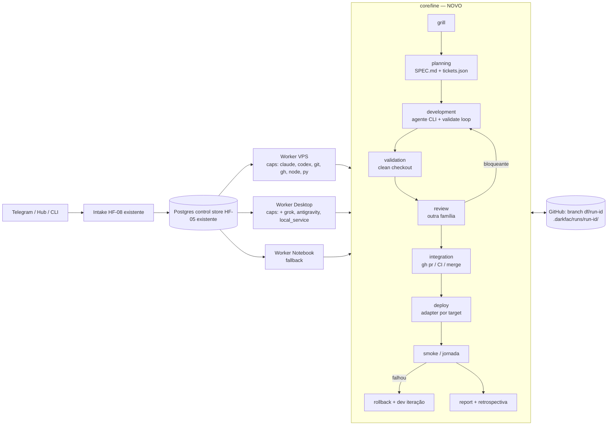

# Linha de produção autônoma — plano HF-27

Versão 1.0 · 22/09/2026 · origem `user-demand` · papel: planejamento (high) · nenhuma implementação feita aqui.
Handoffs executáveis: [docs/handoffs/production-line/INDEX.md](handoffs/production-line/INDEX.md).

Escopo **exclusivo**: funcionalidade e autonomia ponta a ponta com bom custo-benefício.
Segurança e governança ficam como estão (nem endurecidas, nem relaxadas). Nenhum arquivo protegido por `guard.py` é alterado por este plano.

## 1. Diagnóstico — por que a fábrica não roda sozinha

A DarkFac tem um **plano de controle** maduro: intake transacional, leases/fencing, outbox, reconciliador, supervisor, Postgres/DBOS, observador e rotas qualificadas.
O que falta é a **linha de produção**, ou seja, as poucas etapas que produzem efeito real. Hoje elas não estão ligadas ao runtime:

| # | Achado (verificado no código em 22/09) | Efeito |
| --- | --- | --- |
| D1 | `core/orchestrator/cloud_worker.py::dispatch_claimed_job` não usa `HandlerRegistry`. Toda etapa grava `<stage>_deliverable.json` e finaliza `success`. `build_handlers()` não é chamado em nenhum ponto de produção. | O run `run-dde02a573f38` fica "completed" sem entregar nada. O Codex confirmou isso no HF-03-08 (`MOCK_TERMINAL_STAGES`, `GENERIC_WORKER_SUCCESS`). |
| D2 | O prompt de planning/development é só `"Run ID / Stage / Ticket … implemente a solução completa"`. Não leva demanda, spec, repositório nem comando de teste. | Mesmo com um harness real, o agente não sabe o que fazer. |
| D3 | `remote_worker._run_codex_headless` usa `--sandbox read-only --ephemeral`. `_run_claude_headless` usa `claude -p` sem `--permission-mode`. O `cwd` nunca é enviado pelo `RemoteMultiHarnessModelProvider`. | O agente não consegue escrever código e roda na raiz da DarkFac, não no projeto-alvo. |
| D4 | Não existe código que crie branch, commit, push, PR ou merge. `GitHubClient` só lê snapshots, e `delivery_executor` só reconcilia um PR que já existe. | Sem integração, não há entrega. |
| D5 | `.factory/projects.json` só tem `path` do Windows, sem `repo_url`, branch ou comandos de setup/validate/build/smoke. | A nuvem não sabe clonar, testar nem publicar nenhum projeto. |
| D6 | Os handlers especializados (`development_handlers`, `quality_handlers`, `integration_handler`, `release_handlers`, `planning_jobs`) são cascas. Sem `executor_func` injetado, eles sintetizam diff/SHA falsos (baseline fixa `83e5298…`) e guardam o estado só em memória. | Mesmo ligados ao worker, continuariam sem efeito real. |
| D7 | Planning gera **um** ticket por run. Não há decomposição de uma demanda em N tickets nem divisão de produto em marcos. | Não entrega produto ponta a ponta, só mudança unitária. |
| D8 | Toda etapa gera um job `memory_observation` (successors.py). | Dobra o número de jobs e de slots, sem ganho funcional no caminho crítico. |
| D9 | `harness_router` escolhe o harness só pela etapa. Ele não consulta a pressão de quota (`core/router/token_budget.py`, v0: HEALTHY>50 / GUARDED≤50 / STRESSED≤25 / CRITICAL≤10 %). | Não garante "assinatura primeiro, OpenRouter só em nível crítico". |
| D10 | O Grill é heurístico ou roda em Ollama local e não faz uma rodada única com defaults e timeout. No worker cloud, a etapa grill só marca sucesso. | As dúvidas de negócio não chegam ao owner, e as técnicas não são resolvidas sozinhas. |

Conclusão: **não falta arquitetura, falta composição**. Os 33 tickets do HF-26 construíram o chassi, e agora é preciso instalar o motor.
A recomendação é **não abrir mais trilhas de controle**. O trabalho é ligar ~8 executores reais a esse chassi, cada um pequeno e testável.

## 2. Decisões do owner (Grill desta sessão, 22/09)

1. **Execução:** a preferência é a VPS 24/7 com as assinaturas. Isso é viável para **Claude Code** (`claude setup-token` → `CLAUDE_CODE_OAUTH_TOKEN`, cobrado na assinatura Pro) e para **Codex** (`codex login --device-auth` → `~/.codex/auth.json`, cobrado no plano ChatGPT; exige habilitar "device code login" nas configurações de segurança do ChatGPT). Grok e Antigravity continuam no Desktop. Topologia: **VPS primária para Claude/Codex, Desktop como fallback e para Grok/Antigravity/local_service, Notebook como segundo fallback**. Se o login na VPS falhar na prática, o Desktop assume como primário sem mudança de código, porque a escolha é feita por capability.
2. **Contas:** todas as assinaturas (Claude Code Pro, SuperGrok, Codex, Antigravity) podem ser consumidas livremente. OpenRouter só entra em tarefas marcadas `openrouter_ok` ou quando **todas** as assinaturas elegíveis para a etapa estiverem em CRITICAL ou em cooldown. Os limiares da v0 de `token_budget.py` são o default e ficam em arquivo de configuração editável.
3. **Release:** com testes, revisão cruzada e CI verdes, a fábrica faz **merge + deploy em produção + smoke** sozinha, com **rollback automático** se o smoke falhar. Projetos com `requires_commercial_acceptance=true` param antes do deploy (política existente preservada).
4. **Grill:** **uma rodada** e uma única mensagem. Perguntas técnicas são resolvidas pelo recomendado e registradas como premissa. Só intenção, negócio e segredo bloqueiam. Sem resposta em **12 h**, a fábrica segue com o recomendado, **exceto segredos e contas**, que continuam bloqueando só os jobs dependentes.

## 3. Arquitetura alvo (delta mínimo)

Princípios de desenho:

- **O agente CLI é o executor.** Claude Code e Codex já são loops de ferramentas completos. A DarkFac não reimplementa tool-loop (o `AgentExecutor` fica para usos internos). Ela monta o prompt, fixa o `cwd` na worktree, roda o CLI em modo escrita, mede e verifica.
- **O Git é o barramento de artefatos entre etapas e hosts.** Cada run tem a branch `df/<run_id>` com `.darkfac/runs/<run_id>/` (`DEMAND.md`, `GRILL.md`, `SPEC.md`, `tickets.json`, `validate-N.log.md`, `review-N.md`, `REPORT.md`). Uma etapa que roda em outro host faz `fetch` da branch e continua. Não é preciso storage compartilhado nem artifact store para o conteúdo. O artifact store cloud continua para recibos.
- **Uma demanda gera uma branch e um PR.** Os tickets viram commits sequenciais dentro da etapa development, cada um validado. Uma demanda grande (produto novo) é quebrada pelo planner em **marcos**, e cada marco vira uma demanda filha submetida pelo próprio intake com dependência `requires`. O mecanismo de intake existente é reaproveitado, sem fan-out paralelo novo.
- **Afinidade por capability.** Cada job ganha `required_capabilities` derivadas do projeto e da etapa (ex.: `harness:claude`, `repo:site-ggcampos`, `target:local_service`). O `claim()` do Postgres já filtra por esse subconjunto. O Desktop e o Notebook rodam **o mesmo `cloud_worker`** apontando para o Postgres via Tailscale. Não há HTTP síncrono de 30 min entre nuvem e on-prem.
- **Nada de sucesso sem efeito.** Uma etapa sem executor real falha com `missing_handler`, conforme já corrigido pelo Codex na branch `codex/hf-03-08-activation`, que deve ser integrada antes.

## 4. Pacote HF-27 — 10 tickets cirúrgicos

Cada ticket tem no máximo 4 arquivos principais novos ou alterados, testes focais, e pode ser feito por um modelo econômico com binding high já resolvido aqui.
Detalhes, contratos e aceite em cada handoff.

| Ticket | Entrega | Depende de | Onda |
| --- | --- | --- | --- |
| [HF-27-01](handoffs/production-line/HF-27-01.md) | Registry de projetos executável + autodetecção de comandos | — | 1 |
| [HF-27-02](handoffs/production-line/HF-27-02.md) | Workspace Git por run (clone, worktree, branch, contexto `.darkfac/runs`) | 01 | 1 |
| [HF-27-03](handoffs/production-line/HF-27-03.md) | `AgentCLI` real (modo escrita, cwd, modelo, uso) + roteamento por quota | — | 1 |
| [HF-27-04](handoffs/production-line/HF-27-04.md) | Grill de rodada única + Planning com SPEC/tickets/marcos | 02, 03 | 2 |
| [HF-27-05](handoffs/production-line/HF-27-05.md) | Development + validate loop + review cruzada | 02, 03 | 2 |
| [HF-27-06](handoffs/production-line/HF-27-06.md) | Integração GitHub via `gh` (PR, CI, merge, conflito) | 02 | 2 |
| [HF-27-07](handoffs/production-line/HF-27-07.md) | Deploy + smoke + rollback por target (dokploy, ftp, local_service) | 01, 06 | 2 |
| [HF-27-08](handoffs/production-line/HF-27-08.md) | Ligar a linha no worker: registry real, DAG enxuto, canal humano e relatório | 04–07 | 3 |
| [HF-27-09](handoffs/production-line/HF-27-09.md) | Topologia: imagem VPS com CLIs + workers on-prem via Postgres | 03 | 2 (paralelo) |
| [HF-27-10](handoffs/production-line/HF-27-10.md) | Canário E2E diário + dogfood do backlog DarkFac | 08, 09 | 4 |

Caminho crítico: 01 → 02 → (04 ∥ 05 ∥ 06 → 07) → 08 → 10. HF-27-03 e HF-27-09 correm em paralelo desde o início.
Estimativa grosseira: cada ticket de ~0,5 a 1 dia de agente. A onda 2 pode rodar em 3–4 worktrees paralelas porque o ownership de arquivos é disjunto (ver INDEX).

## 5. O que pausar ou rebaixar (para liberar a linha)

Não é para apagar nada, só tirar do caminho crítico:

- **HF-03-08:** concluir como **contenção + preparação**, que é o que o Codex já tem na branch: worker fail-closed, auth do coordenador, digest de imagem, heartbeat de lease. Integrar ao `main` e **não** abrir o replan de 5 unidades proposto no ACTIVATION-RESULT. HF-27-08 e HF-27-10 cobrem os itens 1–3 dele de forma funcional.
- **HF-15-02 (protocolo 24 h V01–V13):** substituir como critério de "funciona" pelo **canário contínuo** de HF-27-10. O protocolo pode voltar depois como auditoria.
- **Etapas fora do caminho crítico:** `research`, `learning_eval`, `catalog_refresh` e `memory_observation` por etapa. Ficam como **um** job `retrospective` por run, de baixa prioridade e que nunca bloqueia a entrega (HF-27-08).
- **Artefatos de contrato HF (integrity.json, verify.py, plan_digest) na linha de produto:** a linha entrega produtos e não exige handoff HF por demanda. O formalismo HF continua valendo para o roadmap do núcleo DarkFac enquanto ele não for alimentado pela própria linha (dogfood, HF-27-10).

## 6. Custo-benefício (política de roteamento proposta)

| Etapa | Primário (assinatura) | Fallback (assinatura) | OpenRouter |
| --- | --- | --- | --- |
| grill | Claude Code Sonnet | Codex | `openrouter_ok` (barato) |
| planning | Claude Code Opus (esforço alto) | Codex (esforço alto) | só se todos CRITICAL |
| development | Claude Code Sonnet | Codex → Grok (Desktop) → Antigravity (Desktop) | só se todos CRITICAL |
| review | **família diferente** da que implementou (Codex se dev foi Claude, e vice-versa) | Grok | `openrouter_ok` (modelo barato de outra família) |
| distill de logs / resumo | — | — | `openrouter_ok` ou Ollama local |

- Os limiares, cascatas, modelos e tetos ficam em `.factory/config/line_routing.json`, com a v0 de `token_budget.py` como default (ver HF-27-03).
- **Cooldown reativo:** quando o CLI responde com rate limit ou uso excedido, a conta fica em cooldown até o reset informado (ou 1 h) e o job segue para o próximo da cascata. Isso cobre contas sem leitura de quota (Claude Pro).
- **Teto por run** (default): 14 invocações de agente, 3 iterações de validate por ticket, 2 rodadas de review, 6 h de relógio e US$ 2 de OpenRouter. Estourou: `WAITING_HUMAN` com relatório, não loop.

## 7. Entradas humanas IMPOSSÍVEIS de automatizar (lista fechada)

A fábrica deve tentar tudo o mais sozinha: detectar, sondar, gerar comando e verificar.
Só estes itens viram `HumanRequest`, com guia passo a passo e verificação automática depois:

1. **Claude Code na VPS:** rodar `claude setup-token` (fluxo OAuth no navegador do owner) e colar o token no env `CLAUDE_CODE_OAUTH_TOKEN` do serviço worker no Dokploy. A fábrica valida com `claude -p "ok" --output-format json`.
2. **Codex na VPS:** habilitar "device code login" nas configurações de segurança do ChatGPT e aprovar o código que a fábrica envia pelo Telegram (`codex login --device-auth` roda no container). Obs.: usar a mesma conta em Desktop e VPS pode rotacionar o refresh token. Se isso acontecer, a fábrica detecta `auth_expired`, faz cooldown do host e reemite o código.
3. **Acesso administrativo à VPS para a fábrica:** chave SSH pública da fábrica em `authorized_keys` e/ou API key do Dokploy (gerada só pela UI). A tentativa SSH do HF-03-08 falhou por autenticação.
4. **Tailscale:** gerar auth keys para a VPS e para os hosts on-prem, para que os workers on-prem alcancem o Postgres. Só a UI do Tailscale emite chaves.
5. **GitHub:** um PAT fine-grained (ou `gh auth login`) com `contents`, `pull_requests`, `workflows` e `checks` de leitura/escrita nos repositórios registrados, se o `GITHUB_TOKEN` atual não tiver esses escopos. A fábrica sonda os escopos antes de pedir.
6. **Credenciais de targets de terceiros:** FTP da Hostinger (ATRIUM) e outros painéis que não expõem API de emissão.
7. **Upgrade de VPS (billing):** a CX23 (2 vCPU, 4 GB) comporta **1 slot de agente** além do stack atual. Para 2+ agentes em paralelo ou builds pesados (Next.js), subir para CX33 ou superior. É decisão de compra, não automatizável.
8. **Respostas de negócio do Grill** e aceite comercial em projetos `client`.

## 8. Critério de pronto do pacote

- **V1:** uma demanda nova enviada pelo Telegram vira branch, PR com testes, merge, deploy, smoke verde e relatório no Telegram, sem nenhuma ação humana além do intake e das respostas de negócio do Grill.
- **V2:** o canário diário (HF-27-10) passa 7 dias seguidos. Falhas se recuperam sozinhas (retry/rollback) ou geram `HumanRequest` classificado na lista da seção 7.
- **V3:** com o worker VPS parado, o Desktop assume os jobs `harness:claude|codex` em até 1 ciclo de poll. Com todas as assinaturas em cooldown, apenas as etapas `openrouter_ok` avançam, e o resto espera o reset com wakeup explícito.
- **V4:** uma demanda de produto novo (greenfield via `core.adoption`) é quebrada em marcos, e cada marco é entregue como PR e deploy próprios.
