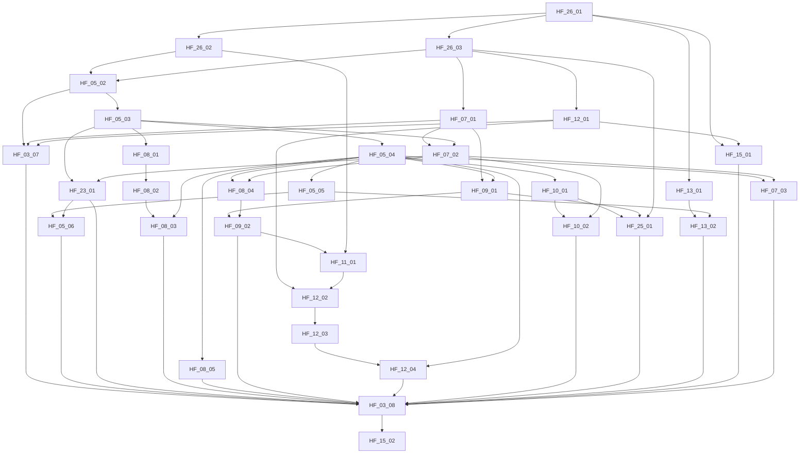

# Índice de handoffs de autonomia contínua

33 unidades + marco HF-26. Primeiro: [HF-26-01](HF-26-01.md).

Todos especificados; só HF-26-01 sem predecessor técnico. Prontidão de contrato não autentica despacho. Nenhum implementado por este pacote.

| Ticket | Papel | Estado | Depende de |
| --- | --- | --- | --- |
| [HF-26-01](HF-26-01.md) — Resolvedor puro de política efetiva | economy | ready_for_handoff | — |
| [HF-26-02](HF-26-02.md) — Aplicar precedência sem ampliar permissões | economy | waiting_dependency | HF-26-01 |
| [HF-26-03](HF-26-03.md) — Reconciliar baseline local e remota | high_architecture | waiting_dependency | HF-26-01 |
| [HF-05-02](HF-05-02.md) — Binding do controle cloud e ownership | high_architecture | waiting_dependency | HF-26-02, HF-26-03 |
| [HF-05-03](HF-05-03.md) — Persistência canônica e adaptadores | economy | needs_architecture_binding | HF-05-02 |
| [HF-05-04](HF-05-04.md) — Handlers e materialização de sucessores | economy | waiting_dependency | HF-05-03 |
| [HF-05-05](HF-05-05.md) — Supervisor de todo portfólio | economy | implemented | HF-05-04 |
| [HF-05-06](HF-05-06.md) — Entrypoints cloud permanentes | economy | implemented | HF-05-05, HF-23-01 |
| [HF-23-01](HF-23-01.md) — Reserva única e justiça de portfólio | economy | needs_architecture_binding | HF-05-03, HF-07-02 |
| [HF-08-01](HF-08-01.md) — Intake atômico e documental explícito | economy | implemented | HF-05-03 |
| [HF-08-02](HF-08-02.md) — Hub e CLI usam intake canônico | economy | waiting_dependency | HF-08-01 |
| [HF-08-03](HF-08-03.md) — Telegram e importação de legado | economy | implemented | HF-08-02, HF-05-04 |
| [HF-08-04](HF-08-04.md) — Planejamento contínuo do escopo conhecido | economy | needs_architecture_binding | HF-05-04, HF-07-02 |
| [HF-08-05](HF-08-05.md) — Probe e retomada de dependências manuais | economy | waiting_dependency | HF-05-04 |
| [HF-07-01](HF-07-01.md) — Binding de executores e contas reais | high_architecture | waiting_dependency | HF-26-03 |
| [HF-07-02](HF-07-02.md) — Rotas qualificadas e fallback | economy | needs_architecture_binding | HF-07-01, HF-05-03 |
| [HF-07-03](HF-07-03.md) — Catálogo diário recuperável | economy | needs_architecture_binding | HF-05-04, HF-07-02 |
| [HF-09-01](HF-09-01.md) — Binding de agentes e revisão por etapa | high_architecture | waiting_dependency | HF-07-01, HF-05-04 |
| [HF-09-02](HF-09-02.md) — Consumers de desenvolvimento e qualidade | economy | needs_architecture_binding | HF-09-01, HF-08-04 |
| [HF-11-01](HF-11-01.md) — Integração GitHub reconciliada | economy | implemented | HF-09-02, HF-26-02 |
| [HF-12-01](HF-12-01.md) — Binding de build e targets reais | high_architecture | waiting_dependency | HF-26-03 |
| [HF-12-02](HF-12-02.md) — Build real e adapter de deploy | economy | needs_architecture_binding | HF-12-01, HF-11-01 |
| [HF-12-03](HF-12-03.md) — Jornada e rollback observados | economy | needs_architecture_binding | HF-12-02 |
| [HF-12-04](HF-12-04.md) — Release automática por evidência | economy | implemented | HF-12-03, HF-05-04 |
| [HF-10-01](HF-10-01.md) — Memória por eventos e contexto fixado | economy | implemented | HF-05-04 |
| [HF-10-02](HF-10-02.md) — Pesquisa ligada às decisões | economy | needs_architecture_binding | HF-10-01, HF-07-02 |
| [HF-25-01](HF-25-01.md) — Evolução avaliada e aplicada após restart | economy | needs_architecture_binding | HF-10-01, HF-09-01, HF-26-03 |
| [HF-13-01](HF-13-01.md) — Prontidão e evidência no roadmap | economy | implemented | HF-26-01 |
| [HF-13-02](HF-13-02.md) — Painel de progresso e estagnação | economy | implemented | HF-13-01, HF-05-05 |
| [HF-15-01](HF-15-01.md) — Observador e protocolo negativo | economy | implemented | HF-26-01, HF-12-01 |
| [HF-03-07](HF-03-07.md) — Preflight por host e projeto | high_architecture | implemented | HF-05-02, HF-07-01, HF-12-01 |
| [HF-03-08](HF-03-08.md) — Ativação isolada e fatia vertical | operations | waiting_dependency | HF-03-07, HF-05-06, HF-23-01, HF-08-03, HF-08-05, HF-09-02, HF-12-04, HF-10-02, HF-25-01, HF-13-02, HF-15-01, HF-07-03 |
| [HF-15-02](HF-15-02.md) — Aceitação24h e expansão multi-projeto | independent_observer | waiting_dependency | HF-03-08 |

## DAG normativo

Concorrência exige dependências e ownership sem sobreposição. Serializar HF-05-05/HF-08-05 em reconciliation.py e HF-08-02/HF-13-02 em hub/backend/service.py. Binding high antecede econômico; observador independente aprova operação.
