# Binding de Executores e Contas Reais (HF-07-01)

Versão 1.0 · 18/09/2026 · Ticket de Arquitetura Superior `HF-07-01` · Handoff Normativo e Vinculante.  
Baseline: `83e5298eb231599076811802dceac8575c7f6feb` · Dependência: [HF-26-03](BASELINE.md) · Ambiente: `executor-binding`.  
Contrato comum obrigatório: [CONTRACTS.md](../CONTRACTS.md) · Especificação: [HF-07-01.md](../HF-07-01.md).

---

## 1. Contexto, Escopo e Governança Normativa

O presente documento estabelece o **binding formal e determinístico de executores, modelos de linguagem, contas de serviço, cotas e ferramentas de execução** para o ecossistema autônomo da **DarkFactory**.

### 1.1. Invariantes de Governança
1. **Local-First & Custo Zero ($0 First)**: Toda microtarefa, teste unitário, geração de fixtures ou análise sintática/lógica local deve ser despachada prioritariamente para o cluster local Ollama (`localhost:11434`), consumindo zero créditos externos.
2. **Inviolabilidade do Piso Arquitetural**: É estritamente proibido rebaixar silenciosamente tarefas de planejamento ou arquitetura (`high_architecture`) para modelos econômicos (`economy`). A ausência de cota ou indisponibilidade de modelos de topo suspende o job em `WAITING_RESOURCE` com wakeup estruturado, preservando a qualidade analítica.
3. **Reserva Orçamentária Obrigatória**: Proibição estrita de chamadas tarifadas (APIs da Anthropic, OpenRouter, xAI) sem um `ReservationRecord` ativo emitido previamente pelo `ExecutionBudgetManager`.
4. **Verificação de Tool-Calling Real**: Modelos puramente textuais ou interfaces de chat que não comprovem suporte funcional a tool-calling estruturado (edição de arquivo, invocação de comandos, subagentes e inspeção) são desqualificados sumariamente.
5. **Isolamento de Ambiente**: Assinaturas desktop de desenvolvimento (ex: IDE, wrappers interativos) **não** comprovam capacidade nem disponibilidade para operação contínua em servidores VPS/Docker headless.
6. **TTL de Roteamento de 24 Horas**: Todo catálogo de preços, limites de taxa e latências possui validade de 24 horas (`ttl_seconds: 86400`), exigindo reavaliação periódica via sondagens e benchmarks diários.

---

## 2. Catálogo de Provedores e Executores

### 2.1. Provedor Local ($0 Local First via Ollama)
* **Host**: `http://localhost:11434`
* **Tipo de Autenticação**: Nenhuma (Processo local isolado)
* **Mecanismo de Tool-Calling**: Subprocesso headless / CLI / Interceptador estruturado
* **Status Operacional**: Ativo

| Modelo | Alias | Família | Parâmetros | Contexto Máximo | Papéis Autorizados | Caso de Uso Primário |
| :--- | :--- | :--- | :--- | :--- | :--- | :--- |
| `qwen-code-fast:latest` | `qwen-fast` | Qwen | 30B MoE (8 P-Cores) | 4.096 (4k) | `economy` | Microtarefas, mocks, fixtures, testes rápidos |
| `qwen-code-deep:latest` | `qwen-deep` | Qwen | 30B MoE (20 Threads) | 16.384 (16k) | `economy` | Análise sintática/lógica local, coding offline |
| `gpt-review:latest` | `gpt-review` | GPT-OSS | 20B (20 Threads) | 16.384 (16k) | `verifier`, `independent_review` | Revisão adversarial de diffs, oráculos locais |

### 2.2. Provedores em Nuvem (Assinaturas e APIs Tarifadas)

#### A. Antigravity Native Engine (Google)
* **Host**: Contexto nativo Antigravity / Google APIs
* **Tipo de Autenticação**: Sessão integrada Antigravity / API Key
* **Mecanismo de Tool-Calling**: Native Function Calling & Antigravity MCP Tools
* **Modelos**:
  * `google/gemini-3.8-flash` (`gemini-flash`): Orquestrador central da fábrica. Contexto massivo de 1M+ tokens, latência ultra-baixa, alta fidelidade de tool-calling.
  * `google/gemini-3.1-pro` (`gemini-pro`): Raciocínio arquitetural multi-passo de alta capacidade, análise conceitual profunda.

#### B. Anthropic Claude Engine
* **Host**: `https://api.anthropic.com/v1`
* **Tipo de Autenticação**: `ANTHROPIC_API_KEY` (SecretReference: `env:ANTHROPIC_API_KEY`)
* **Mecanismo de Tool-Calling**: Native Tool Use (`text_editor`, `bash`, schemas JSON)
* **Modelos**:
  * `anthropic/claude-3.7-sonnet` (`claude-3-7-sonnet`): Modelo de fronteira para planejamento arquitetural superior, PRDs, definição de non-goals e decomposição de DAGs complexos com Thinking tokens.

#### C. OpenRouter Gateway
* **Host**: `https://openrouter.ai/api/v1`
* **Tipo de Autenticação**: `OPENROUTER_API_KEY` (SecretReference: `env:OPENROUTER_API_KEY`)
* **Mecanismo de Tool-Calling**: OpenAI Function Calling Compatible
* **Modelos**:
  * `deepseek/deepseek-r1` (`deepseek-r1`): 671B MoE. Raciocínio matemático, invariantes de concorrência e oráculos formais com custo extremamente competitivo.
  * `deepseek/deepseek-v4.1-flash` (`deepseek-v4.1-flash`): Contexto de 1M de tokens, ideal para revisão independente em nuvem com identidade isolada (cross-model family).

#### D. xAI Grok Engine
* **Host**: `https://api.x.ai/v1`
* **Tipo de Autenticação**: `XAI_API_KEY` (SecretReference: `env:XAI_API_KEY`) / SuperGrok Session
* **Mecanismo de Tool-Calling**: Live Web Search & Tools
* **Modelos**:
  * `xai/grok-4.6` (`grok-4.6`): Pesquisa web viva, documentações dinâmicas e varredura de breaking changes em ecossistemas externos.

---

## 3. Matriz de Capacidades, Limites de Tokens e Custos

A tabela a seguir consolida a matriz operacional de custos (por 1k tokens) e capacidades técnicas:

| Executor / Modelo | Família | Janela de Contexto | Custo Input / 1k | Custo Output / 1k | Cache Read / 1k | Throughput Típico | Tool-Calling Suportado |
| :--- | :--- | :--- | :--- | :--- | :--- | :--- | :--- |
| `qwen-code-fast:latest` | Qwen | 4.096 tokens | **$0,00000** | **$0,00000** | $0,00000 | ~80 tps | Sim (CLI Subprocess) |
| `qwen-code-deep:latest` | Qwen | 16.384 tokens | **$0,00000** | **$0,00000** | $0,00000 | ~45 tps | Sim (CLI Subprocess) |
| `gpt-review:latest` | GPT-OSS | 16.384 tokens | **$0,00000** | **$0,00000** | $0,00000 | ~50 tps | Sim (Diff/Linter) |
| `google/gemini-3.8-flash` | Gemini | 1.048.576 tokens | $0,00015 | $0,00060 | $0,0000375 | ~150 tps | Sim (Native MCP) |
| `google/gemini-3.1-pro` | Gemini | 1.048.576 tokens | $0,00125 | $0,00500 | $0,0003125 | ~65 tps | Sim (Native MCP) |
| `anthropic/claude-3.7-sonnet` | Claude | 200.000 tokens | $0,00300 | $0,01500 | $0,0003000 | ~75 tps | Sim (Native Tools) |
| `deepseek/deepseek-r1` | DeepSeek | 163.840 tokens | $0,00055 | $0,00219 | $0,0001400 | ~40 tps | Sim (OpenAI JSON) |
| `deepseek/deepseek-v4.1-flash`| DeepSeek | 1.048.576 tokens | $0,00015 | $0,00060 | $0,0000375 | ~110 tps | Sim (OpenAI JSON) |
| `xai/grok-4.6` | Grok | 131.072 tokens | $0,00200 | $0,01000 | $0,0005000 | ~85 tps | Sim (Web & Tools) |

*Nota: Custos locais são estritamente $0,00000 (consumo elétrico/hardware local coberto). Custos em nuvem são calculados e reservados pelo `ExecutionBudgetManager` antes do despacho.*

---

## 4. Mapeamento Formal de Papéis (Role -> Allowed Models)

O roteador de execução (`core/workflow/qualified_routes.py` e `core/portfolio/router_optimizer.py`) vincula cada tipo de etapa (`StageContext.role`) a um conjunto fechado de modelos autorizados:

```mermaid
graph TD
    subgraph "Papel: economy"
        E1["qwen-code-fast:latest (Local $0)"] -->|Fallback 1| E2["qwen-code-deep:latest (Local $0)"]
        E2 -->|Fallback 2| E3["google/gemini-3.8-flash (Nuvem / Assinatura)"]
    end

    subgraph "Papel: high_architecture"
        A1["anthropic/claude-3.7-sonnet (Planejamento Superior)"] -->|Fallback 1| A2["deepseek/deepseek-r1 (Raciocínio Nuvem)"]
        A2 -->|Fallback 2| A3["google/gemini-3.1-pro (Arquitetura Multi-Passo)"]
        A3 -->|Sem Cotas| BL["Bloqueio em WAITING_RESOURCE (Anti-Degradação)"]
    end

    subgraph "Papel: verifier / independent_review"
        V1["gpt-review:latest (Local $0)"] -->|Alternativa Nuvem| V2["deepseek/deepseek-v4.1-flash (OpenRouter)"]
        V2 -->|Pesquisa Cruzada| V3["xai/grok-4.6 (xAI)"]
    end
```



### 4.1. Papel `economy`
* **Atribuição**: Microtarefas, geração de massas de dados de teste, fixtures sintéticas, validações de compilação, tarefas repetitivas.
* **Modelo Primário**: `qwen-code-fast:latest` (Local $0).
* **Ordem de Failover**: `qwen-code-fast:latest` → `qwen-code-deep:latest` → `google/gemini-3.8-flash`.

### 4.2. Papel `high_architecture`
* **Atribuição**: Elaboração de PRDs, handoffs de arquitetura, resolução de DAGs de dependências, especificação de interfaces e protocolos.
* **Modelo Primário**: `anthropic/claude-3.7-sonnet`.
* **Ordem de Failover**: `anthropic/claude-3.7-sonnet` → `deepseek/deepseek-r1` → `google/gemini-3.1-pro`.
* **Regra Anti-Degradação**: **Nunca rebaixar para `economy`**. Caso todas as opções estejam com cotas esgotadas, suspender o job em `WAITING_RESOURCE` até o próximo reset de janela.

### 4.3. Papel `verifier` / `independent_review`
* **Atribuição**: Revisão independente de código, auditoria adversarial de segurança e geração de `EvidenceReceipt`.
* **Isolamento Mandatório de Família**: O revisor **DEVE pertencer a uma família de modelos distinta do implementador**.
  * Se o implementador foi `anthropic/claude-3.7-sonnet`, o revisor deve ser `gpt-review:latest` ou `deepseek/deepseek-v4.1-flash`.
  * Se o implementador foi `qwen-fast`, o revisor pode ser `gpt-review:latest` ou `google/gemini-3.8-flash`.

---

## 5. Regras de Roteamento e Políticas de Controle

### 5.1. Roteamento Local-First ($0 First)
1. Antes de reservar orçamento em nuvem, o sistema verifica se o cluster Ollama local possui recursos de CPU/RAM disponíveis e se a complexidade do ticket permite execução local.
2. Havendo suporte local, a chamada ocorre com custo $0, registrando telemetria determinística no `ModelUsageLedger`.

### 5.2. Proibição Estrita de Rebaixamento Silencioso (Anti-Degradação)
* Se um ticket requer `high_architecture` e a conta Anthropic atingir limite de cota horária:
  1. O sistema tenta acionar `deepseek-r1` via OpenRouter (com reserva prévia).
  2. Caso indisponível, tenta `gemini-pro`.
  3. Caso todos falhem, **não há fallback para `qwen-fast`**. O executor emite status `WAITING_RESOURCE`, registra o evento no ledger e agenda um wakeup automático para a expiração do reset da cota mais próxima.

### 5.3. Probes de Verificação de Tool-Calling
1. **Critério de Reprovação Textual**: Um modelo não é qualificado para execução autônoma apenas por seu nome ou declaração textual de capacidade. Deve passar por teste de sonda determinístico executando uma chamada de ferramenta real (`read_file`, `write_file`, `run_command`).
2. **Ambiente Desktop vs. VPS**: A qualificação de uma chave de API ou credencial local em desktop Windows **não autoriza nem comprova** sua operação no ambiente headless VPS Linux/Docker. A qualificação deve ser revalidada no ambiente alvo de execução.
3. **Frequência da Sonda**: Probes de tool-calling são reexecutados a cada 24 horas (`ttl_seconds: 86400`) ou imediatamente após 3 falhas consecutivas de inferência.

### 5.4. Governança Orçamentária e Pre-Reservation
1. Nenhuma requisição HTTP a provedores pagos pode ser despachada sem que um `ReservationRecord` com status `ACTIVE` seja gerado pelo `ExecutionBudgetManager`.
2. O valor reservado corresponde à estimativa conservadora de tokens baseada no teto do ticket.
3. Ao término da chamada (`ProviderResponse`), o custo real medido é confirmado via `budget_manager.commit()`, e o excedente é imediatamente liberado.

### 5.5. Política de Reasoning Effort
* **Valores Permitidos**: `"minimal"`, `"low"`, `"medium"`, `"high"`, `"max"`.
* **Valores Proibidos**: `"xhigh"`, `"extra-high"`, `"extra_high"`, `"ultra"`.
* **Comportamento de Sanitização**: Conforme `core/router/model_router.py`, qualquer parâmetro não homologado é sanitizado para `"max"` sem quebrar a requisição.
* **Default para Arquitetura/Planejamento**: `"high"`.
* **Complexidade Crítica**: `"max"`.

---

## 6. Mapeamento com o `AgentExecutor` e Contratos de Runtime

Os executores deste binding integram-se diretamente ao ciclo de vida formal do `AgentExecutor` (`core/execution/agent_executor.py`):

```python
class AgentExecutor:
    def start(self, spec: TaskSpec) -> ExecutionRun: ...
    def resume(self, checkpoint: Checkpoint) -> ExecutionRun: ...
    def cancel(self, run_id: str, reason: str = ...) -> ExecutionRun: ...
    def execute_step(self, run_id: str, step_prompt: str, *, model: str = ...) -> AttemptRecord: ...
```

* **Início (`start`)**: Instancia um `ExecutionRun` associado a um envelope orçamentário (`Budget`) e uma reserva inicial (`ReservationRecord`).
* **Retomada (`resume`)**: Restaura estado a partir de um `Checkpoint` criptograficamente vinculado ao SHA do candidato, revalidando a lease e o leasing fencing token.
* **Cancelamento (`cancel`)**: Interrompe a execução em voo e libera qualquer reserva orçamentária ativa imediatamente.
* **Execução Bounded (`execute_step`)**: Envia o prompt ao `ModelProvider` configurado (Ollama, OpenRouter, Anthropic, Antigravity) e audita os tokens consumidos e o hash do artefato de saída.

---

## 7. Desbloqueio e Sucessores do DAG

Com a publicação vinculante deste binding (`HF-07-01`), as seguintes unidades downstream tornam-se plenamente desbloqueadas para especificação e implementação:

1. **`HF-07-02`** (*Rotas qualificadas e fallback*): Implementará o algoritmo `select_route(job, catalog, quota, budget) -> RouteDecision`, materializando as regras e a proteção de piso arquitetural definidas aqui.
2. **`HF-09-01`** (*Binding de agentes e revisão por etapa*): Mapeará os handlers de ciclo de vida (`AgentExecutor.start/resume`) para cada estágio do pipeline de desenvolvimento e verificação.
3. **`HF-03-07`** (*Preflight por host e projeto*): Validará as credenciais sanitizadas, limites de contexto e sondas de ambiente em cada host de implantação.

---

*Documento normativo homologado para o pacote de autonomia contínua DarkFactory.*
