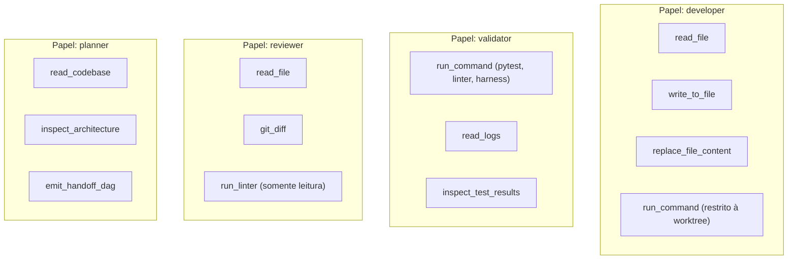

# Binding de Agentes, Handlers e Revisão por Etapa (HF-09-01)

Versão 1.0 · 18/09/2026 · Ticket de Alta Arquitetura `HF-09-01` · Handoff Normativo e Vinculante.  
Baseline: `83e5298eb231599076811802dceac8575c7f6feb` · Parent: `HF-09` · Papel: `high_architecture` · Ambiente: `executor-binding`.  
Dependências: [HF-07-01](EXECUTORS.md), [HF-05-04](../HF-05.md) · Sucessores: `HF-09-02`, `HF-25-01`.  
Contrato comum obrigatório: [CONTRACTS.md](../CONTRACTS.md) · Especificação: [HF-09-01.md](../HF-09-01.md) · Plano Mestre: [CONTINUOUS_AUTONOMY_PLAN_2026-09-18.md](../../../CONTINUOUS_AUTONOMY_PLAN_2026-09-18.md).

---

## 1. Contexto, Escopo e Governança Normativa

O presente documento estabelece o **binding arquitetural formal e determinístico de agentes executores, handlers de estágio, contratos de entrada e saída, conversão de esquemas, matriz de ferramentas e governança de verificação independente** para a operação autônoma contínua da **DarkFactory**.

### 1.1. Invariantes de Governança do Ciclo de Vida
1. **Desacoplamento e Conversão Estrita de Schemas**: Cada estágio do pipeline possui contratos tipados (Pydantic v2 `extra="forbid"`), sendo estritamente proibida a passagem de payloads amorfos, dicionários livres ou tipos não validados.
2. **Inviolabilidade da Separação de Papéis**: O implementador (`developer`) é terminantemente proibido de auditar ou aprovar seu próprio código (`reviewer.subject != developer.subject`). Autoaprovação constitui violação primária de segurança.
3. **Isolamento entre Famílias de Modelos (Cross-Model Family Isolation)**: O agente revisor independente deve pertencer a uma família de modelos distinta do modelo gerador (exemplo: implementação via família Gemini exige revisão por família DeepSeek ou GPT-OSS/Review), mitigando pontos cegos cognitivos compartilhados.
4. **Isolamento Físico de Worktree**: Agentes de desenvolvimento operam em worktrees Git dedicadas e transitórias (`.worktrees/job_{run_id}_{ticket_id}_{iteration}`), sem permissão de escrita fora dos caminhos formalmente autorizados (`allowed_paths`).
5. **Fencing Monotônico e Prevenção de Zombie Leases**: Qualquer operação ou mutação recebida com fencing token divergente do lock ativo é rejeitada sumariamente (`StaleLease`), impedindo que agentes defasados sobreponham execuções mais recentes.
6. **Prevenção Estrita de Recursão em Aprendizado (Anti-Recursion Loop)**: Observações de falha ou sucesso registram obrigatoriamente `causation_id`. Eventos de bookkeeping interno são expurgados na origem para evitar a criação de ciclos espúrios de auto-aprendizado.

---

## 2. Mapeamento dos Estágios do Ciclo de Vida

A tabela a seguir consolida o mapeamento normativo de todos os estágios previstos em [CONTRACTS.md](../CONTRACTS.md) para seus serviços de implementação, assinaturas de método e esquemas de dados correspondentes:

| Estágio | Papel | Serviço Primário | Entrada Contratual | Saída Contratual | Timeout Default |
| :--- | :--- | :--- | :--- | :--- | :--- |
| `grill` | `grill_engine` | `IntegratedIntakeService` / `DemandGrillEngine` | `IntakeCommand` | `GrillRecord` | 300 s (5 min) |
| `planning` | `planner` | `PlanningHandler` / `ReadinessGate` | `GrillRecord` | `WorkflowHandoff` | 600 s (10 min) |
| `research` | `researcher` | `PersistentMemoryService.record_research` | `ResearchQuery` | `ResearchLedger` | 600 s (10 min) |
| `environment` | `environment_probe` | `reconcile_environment_manifest` / Probes | `EnvironmentManifest` | `EnvironmentEvidence` \| `ManualDependency` | 300 s (5 min) |
| `development` | `developer` | `AgentExecutor.start/resume` / `ImplementationCycleService` | `WorkflowHandoff` | `ImplementationCandidate` | 1800 s (30 min) |
| `validation` | `validator` | `ImplementationCycleService.run_validation` + Harness | `ImplementationCandidate` | `ValidationReport` | 900 s (15 min) |
| `independent_review` | `reviewer` | `conduct_independent_review` | `ValidationReport` | `EvidenceReceipt` | 600 s (10 min) |
| `integration` | `integrator` | `RemoteDeliveryReconciler` + GitHub Snapshot | `DeliveryRequest` | `RemoteDeliveryResult` | 600 s (10 min) |
| `memory_observation` | `memory_agent` | `PersistentMemoryService.register_candidate` | `StageResult` | `LearningCandidate` | 300 s (5 min) |
| `learning_eval` | `evaluator` | `FactoryEvolutionEngine` | `EvolutionProposal` | `RollbackSnapshot` | 900 s (15 min) |
| `catalog_refresh` | `catalog_refresh` | `CatalogRefreshHandler` | `BenchmarkTrigger` | `CatalogRefreshState` | 1800 s (30 min) |

---

### 2.1. Estágio `grill` (Desambiguação e Intake Estruturado)
* **Objetivo**: Submeter demandas em linguagem natural ao crivo de ambiguidade (Portão G1), identificando premissas, lacunas materiais e formulando de 2 a 4 perguntas cirúrgicas com opções recomendadas.
* **Componentes**: `core.demands.integrated_service.IntegratedIntakeService` e `core.demands.grill.DemandGrillEngine`.
* **Assinatura**:
  ```python
  IntegratedIntakeService.receive_command(command: IntakeCommand) -> IntakeReceipt
  DemandGrillEngine.generate_questions(demand: DemandRecord) -> list[GrillDecision]
  ```
* **Contrato de Entrada**: `core.workflow.control_contracts.IntakeCommand` (serialização canônica UTF-8, sorted keys, separadores estritos).
* **Contrato de Saída**: `core.workflow.contracts.GrillRecord`.
* **Invariantes e Oráculo**:
  - `ready_for_spec=True` exige estritamente `pending_questions` vazia e `example_criteria` preenchida.
  - Decisões materiais sem resposta retêm o job em `WAITING_HUMAN`.

---

### 2.2. Estágio `planning` (Especificação e Validação de Prontidão)
* **Objetivo**: Decompor a demanda em DAG de handoffs atômicos, definindo objetivos, non-goals, oráculos executáveis e validando elegibilidade no `ReadinessGate`.
* **Componentes**: `core.workflow.planning_jobs.PlanningHandler` e `core.workflow.readiness.ReadinessGate`.
* **Assinatura**:
  ```python
  PlanningHandler.handle(context: StageContext) -> StageResult
  ReadinessGate.evaluate(handoff: WorkflowHandoff, context: VerificationContext | None) -> ReadinessReport
  ```
* **Contrato de Entrada**: `core.workflow.contracts.GrillRecord`.
* **Contrato de Saída**: `core.workflow.contracts.WorkflowHandoff`.
* **Invariantes e Oráculo**:
  - Cardinalidade de `allowed_paths` delimitada a no máximo 4 arquivos por unidade.
  - Grafo acíclico garantido sem dependências circulares.
  - Sem `PlanApproval` confiável, `ReadinessGate` retorna `eligible=False` com código `CONTEXT_REQUIRED`.

---

### 2.3. Estágio `research` (Pesquisa Profunda e Dossier de Evidências)
* **Objetivo**: Conduzir levantamento bibliográfico e tecnológico no arXiv, documentações oficiais e repositórios open-source, persistindo fontes canônicas com hashes verificáveis.
* **Componentes**: `core.learning.service.PersistentMemoryService` e `core.learning.research.KnowledgeLedgerManager`.
* **Assinatura**:
  ```python
  PersistentMemoryService.record_research(
      query: str,
      topic_type: ResearchTopicType,
      sources: list[ResearchSource],
      insights: list[SourceInsight],
      summary_executive: str = "",
      decisions_linked: list[str] | None = None,
      related_tickets: list[str] | None = None,
  ) -> ResearchLedger
  ```
* **Contrato de Entrada**: `core.learning.research.ResearchQuery`.
* **Contrato de Saída**: `core.learning.research.ResearchLedger`.
* **Invariantes e Oráculo**:
  - Proibição estrita de citações sem URL canônica ou locator identificável.
  - Insights rastreiam SHA-256 da fonte consultada para auditoria anti-alucinação.

---

### 2.4. Estágio `environment` (Reconciliação e Probes de Ambiente)
* **Objetivo**: Comparar dependências declaradas no manifesto contra código-fonte inspecionado, detectando portas, endpoints e variáveis exigidas antes do despacho de execução.
* **Componentes**: `core.workflow.reconciliation.reconcile_environment_manifest` e `core.workflow.probes.ExternalTargetProbe`.
* **Assinatura**:
  ```python
  reconcile_environment_manifest(
      manifest: EnvironmentManifest,
      *,
      code_or_diff: str | None = None,
      declared_additions: dict[str, Any] | None = None,
  ) -> tuple[EnvironmentManifest, ManifestDiff]
  ```
* **Contrato de Entrada**: `core.workflow.contracts.EnvironmentManifest`.
* **Contrato de Saída**: `core.workflow.contracts.EnvironmentEvidence` (em caso de probe automatizado aprovado) ou `core.workflow.contracts.ManualDependency` (quando exigida intervenção do operador).
* **Invariantes e Oráculo**:
  - Zero segredos em texto claro em endpoints, URLs ou argumentos.
  - `ManualDependency` exige guia exaustivo tela a tela na interface atual, com sugestões de preenchimento para todos os seletores e campos.

---

### 2.5. Estágio `development` (Execução Bounded e Produção de Candidato)
* **Objetivo**: Executar a implementação do ticket sob orçamento reservado (`ExecutionBudgetManager`), operando em sandbox de processo e worktree Git isolada.
* **Componentes**: `core.execution.agent_executor.AgentExecutor` e `core.workflow.cycle.ImplementationCycleService`.
* **Assinatura**:
  ```python
  AgentExecutor.start(spec: TaskSpec) -> ExecutionRun
  AgentExecutor.resume(checkpoint: Checkpoint) -> ExecutionRun
  ImplementationCycleService.start_development(handoff: WorkflowHandoff, developer: SanitizedIdentity) -> tuple[RunRecord, JobRecord]
  ```
* **Contrato de Entrada**: `core.workflow.contracts.WorkflowHandoff`.
* **Contrato de Saída**: `core.workflow.cycle.ImplementationCandidate`.
* **Invariantes e Oráculo**:
  - `candidate_digest` calculado deterministicamente como SHA-256 dos diffs unificados.
  - Modificações estritamente restritas aos `allowed_paths` do handoff.
  - Proibição de chamadas a provedores tarifados sem reserva de saldo ativa.

---

### 2.6. Estágio `validation` (Verificação Determinística e Harness)
* **Objetivo**: Submeter o candidato gerado à validação objetiva por oráculos de teste (pytest, verificação estática, linters e harness de execução).
* **Componentes**: `core.workflow.cycle.ImplementationCycleService` e `core.harness.runner`.
* **Assinatura**:
  ```python
  ImplementationCycleService.run_validation(
      handoff: WorkflowHandoff,
      candidate: ImplementationCandidate,
      *,
      unit_tests_pass: bool,
      target_probe: ExternalTargetProbe | None = None,
      reconciled_manifest: EnvironmentManifest | None = None,
      manifest_diff: ManifestDiff | None = None,
      tester_identity: SanitizedIdentity | None = None,
      context: VerificationContext | None = None,
  ) -> ValidationCycleResult
  ```
* **Contrato de Entrada**: `core.workflow.cycle.ImplementationCandidate`.
* **Contrato de Saída**: `core.workflow.cycle.ValidationCycleResult` (representando `ValidationReport`).
* **Invariantes e Oráculo**:
  - Evidências determinísticas emitidas com marcadores executáveis (`[HARNESS_PASS]`).
  - Falha nos testes aciona automaticamente o `CorrectionLoopTracker` com rollback de worktree.

---

### 2.7. Estágio `independent_review` (Auditoria Adversarial Cruzada)
* **Objetivo**: Realizar revisão técnica rigorosa do candidato, verificando oráculos de aceitação, ausência de regressões e invariantes de segurança.
* **Componentes**: `core.workflow.cycle.ImplementationCycleService` (`conduct_independent_review`).
* **Assinatura**:
  ```python
  ImplementationCycleService.conduct_independent_review(
      handoff: WorkflowHandoff,
      candidate: ImplementationCandidate,
      reviewer: SanitizedIdentity,
      developer: SanitizedIdentity,
      *,
      approve: bool = True,
      findings: list[str] | None = None,
      counterexamples: list[str] | None = None,
      context: VerificationContext | None = None,
  ) -> tuple[IndependentReviewVerdict, ReadinessReport]
  ```
* **Contrato de Entrada**: `core.workflow.cycle.ValidationCycleResult`.
* **Contrato de Saída**: `core.workflow.contracts.EvidenceReceipt`.
* **Invariantes e Oráculo**:
  - `reviewer.subject != developer.subject` (inviolável, autoaprovação gera `ValueError`).
  - Isolamento obrigatório entre famílias de modelos (ver Seção 6).
  - Aprovação emite `EvidenceReceipt` com `requirement="independent_review"` e assinatura de hash vinculada ao `candidate_digest`.

---

### 2.8. Estágio `integration` (Reconciliação e Merge Remoto)
* **Objetivo**: Submeter o candidato aprovado à fila durável de entrega remota (`MergeQueue`), reconciliar status de PR no GitHub e comprovar commit head.
* **Componentes**: `core.orchestrator.delivery_executor.RemoteDeliveryReconciler` e `core.orchestrator.delivery.DeliveryPolicy`.
* **Assinatura**:
  ```python
  RemoteDeliveryReconciler.reconcile_and_evaluate(
      request: DeliveryRequest,
      *,
      snapshot: PullRequestSnapshot | None = None,
      confirm_merged: bool = False,
  ) -> RemoteDeliveryResult
  ```
* **Contrato de Entrada**: `core.orchestrator.delivery.DeliveryRequest`.
* **Contrato de Saída**: `core.orchestrator.delivery_executor.RemoteDeliveryResult`.
* **Invariantes e Oráculo**:
  - PR com checks vermelhos ou stale_checks reprova sumariamente a entrega.
  - "Merge não é prova de operação": avanço para deploy exige artefato OCI e digest de bytes confirmados conforme `RELEASE.md`.

---

### 2.9. Estágio `memory_observation` (Captura de Aprendizado e Anti-Recursão)
* **Objetivo**: Extrair padrões de falha, anomalias e hipóteses de melhoria a partir de execuções concluídas, registrando candidatos a regra no ledger contínuo.
* **Componentes**: `core.learning.service.PersistentMemoryService`.
* **Assinatura**:
  ```python
  PersistentMemoryService.register_candidate(
      rule_id: str,
      origin: PolicyOrigin | str,
      scope: str,
      rule_content: str = "",
      supporting_runs: list[str] | None = None,
      eval_version: str = "",
      project_id: str | None = None,
      metadata: dict[str, Any] | None = None,
  ) -> LearningCandidate
  ```
* **Contrato de Entrada**: `core.workflow.control_contracts.StageResult`.
* **Contrato de Saída**: `core.learning.models.LearningCandidate`.
* **Invariantes e Oráculo**:
  - Deduplicação rígida por hash de conteúdo e `rule_id`.
  - Atribuição obrigatória de `causation_id` vinculada ao ticket original.
  - Bloqueio sumário de eventos originados de mutações internas de regras de aprendizagem.

---

### 2.10. Estágio `learning_eval` (Sandbox de Holdout e Auto-Evolução)
* **Objetivo**: Submeter propostas de auto-evolução (mutações de código, skills ou prompts) a suítes de holdout isoladas antes de qualquer promoção ao repositório.
* **Componentes**: `core.evolution.engine.FactoryEvolutionEngine` e `core.evolution.holdout.EvolutionHoldoutSandbox`.
* **Assinatura**:
  ```python
  FactoryEvolutionEngine.evaluate_candidate(
      proposal_id: str,
      *,
      holdout_cmd: str | None = None,
      timeout_sec: int = 60,
  ) -> HoldoutEvaluationResult
  FactoryEvolutionEngine.promote_candidate(proposal_id: str) -> RollbackSnapshot
  ```
* **Contrato de Entrada**: `core.evolution.models.EvolutionProposal`.
* **Contrato de Saída**: `core.evolution.models.RollbackSnapshot` (emitindo recibo de promoção).
* **Invariantes e Oráculo**:
  - Arquivos protegidos (`MISSION.md`, `FACTORY_RULES.md`, `AGENTS.md`) são invioláveis na sandbox.
  - Toda promoção captura atomicamente o estado anterior para rollback instantâneo (`RollbackSnapshot`).

---

### 2.11. Estágio `catalog_refresh` (Sondagem e Qualificação de Modelos)
* **Objetivo**: Sondar a cada 24 horas a latência real, integridade de tool-calling e custos de APIs locais e externas, publicando matriz qualificada para novos jobs.
* **Componentes**: `core.workflow.catalog_jobs.CatalogRefreshHandler` e `core.portfolio.router_optimizer.QualificationEngine`.
* **Assinatura**:
  ```python
  CatalogRefreshHandler.handle(context: StageContext) -> StageResult
  ```
* **Contrato de Entrada**: `core.workflow.catalog_jobs.CatalogRefreshState` (via timer 24 h).
* **Contrato de Saída**: `core.workflow.catalog_jobs.CatalogRefreshState` (catálogo qualificado e promovido).
* **Invariantes e Oráculo**:
  - Runs em andamento mantêm catálogo fixado (`pinned_run_ids`); novo catálogo vigora apenas para novos despachos.
  - Falha em sondagem externa preserva o último catálogo válido com timestamp de degradação.

---

## 3. Matriz de Ferramentas Permitidas por Papel (Tool Allowlists)

Para garantir segurança em profundidade e impedir que agentes realizem ações fora de seu escopo, cada papel possui uma lista restrita de ferramentas de execução:



### 3.1. Detalhamento da Matriz de Ferramentas

| Papel (`role`) | Ferramentas Permitidas (`allowed_tools`) | Ferramentas Proibidas (`forbidden_tools`) | Escopo de Execução |
| :--- | :--- | :--- | :--- |
| `developer` | `read_file`, `write_to_file`, `replace_file_content`, `run_command` | `git_push_main`, `delete_repository`, `bypass_gate`, edição de verificadores | Restrito estritamente à worktree isolada e aos `allowed_paths` do ticket |
| `validator` | `run_command`, `read_logs`, `inspect_test_results` | `write_to_file`, `replace_file_content`, `git_commit` | Somente leitura de código; execução de suites de teste e linters oficiais |
| `reviewer` | `read_file`, `git_diff`, `run_linter`, `inspect_evidence` | `write_to_file`, `replace_file_content`, `git_commit`, `git_push` | Auditoria passiva de código, contraprovas e evidências sem mutação |
| `planner` | `read_codebase`, `inspect_architecture`, `emit_handoff_dag`, `read_project_ledger` | `write_source_code`, `run_deployment`, `modify_secrets` | Leitura da base e emissão de especificações e DAGs decompostos |
| `grill_engine` | `read_demands`, `read_codebase_context`, `generate_questions`, `evaluate_ambiguity` | `write_source_code`, `git_operations` | Extração de premissas e redação de perguntas cirúrgicas |
| `researcher` | `read_sources`, `web_search`, `arxiv_search`, `record_ledger` | `write_source_code`, `modify_runtime` | Pesquisa de referências e gravação de dossiês em `.factory/research/` |
| `environment_probe`| `inspect_manifest`, `probe_network`, `probe_ports`, `probe_services`, `reconcile_diff` | `write_source_code`, `modify_credentials` | Verificação de portas e conectividade de rede sem credenciais em texto claro |
| `integrator` | `github_pr_snapshot`, `git_merge`, `git_push`, `verify_remote_head` | `force_push`, `skip_ci`, `delete_branch_main` | Operações Git na fila de entrega conforme `DeliveryPolicy` |
| `memory_agent` | `inspect_run_result`, `extract_failure_pattern`, `register_candidate_rule`, `audit_causation_id`| `write_source_code`, `delete_ledger` | Registro append-only de regras no ledger contínuo |
| `evaluator` | `sandbox_evaluate`, `run_holdout`, `promote_skill`, `rollback_skill` | `write_protected_files`, `bypass_holdout` | Execução em sandbox de holdout com captura atômica de snapshot |
| `catalog_refresh`| `probe_provider_latency`, `probe_model_cost`, `execute_model_smoke`, `promote_catalog` | `modify_codebase`, `bypass_timeout` | Sondagem periódica e atualização atômica do catálogo em disco |

---

## 4. Isolamento de Worktree, Concorrência e Sandboxing

Para viabilizar execução concorrente segura e evitar condições de corrida em branches ou modificações acidentais na working copy principal:

1. **Worktree Exclusiva por Execução**:
   - Cada execução de desenvolvimento recebe uma worktree Git independente localizada em `.worktrees/job_{run_id}_{ticket_id}_{iteration}`.
   - A criação e desmontagem são geridas pelo harness, assegurando checkout limpo na baseline correspondente.
2. **Gravações Delimitadas (Fail-Closed Boundaries)**:
   - O `AgentExecutor` e o sandbox de processo barram qualquer tentativa de gravação fora dos limites da worktree ou que tente alterar arquivos além dos declarados em `allowed_paths`.
   - Modificações em arquivos de governança (`MISSION.md`, `FACTORY_RULES.md`, `AGENTS.md`) geram término imediato do run com status `failed`.
3. **Limpeza e Preservação**:
   - Worktrees de jobs concluídos com sucesso são removidas automaticamente após o merge ou geração do patch de entrega.
   - Em caso de falha (`FAILED_VALIDATION`), a worktree é preservada temporariamente para inspeção e coleta forense de logs pelo `CorrectionLoopTracker`.

---

## 5. Fencing Monotônico, Leases, Heartbeats e Timeouts

A integridade do estado e o controle de concorrência distribuída são garantidos pelo protocolo do `ControlStore`:

### 5.1. Parâmetros Temporais Normativos
* **Duração do Lease (`lease_duration_sec`)**: **45 segundos**.
* **Intervalo de Heartbeat (`heartbeat_interval_sec`)**: **10 segundos**.
* **Timeout Padrão de Unidade (`max_job_timeout_sec`)**: **1.800 segundos (30 minutos)**.
* **Timeouts Especializados por Estágio**:
  - `grill` / `environment` / `memory_observation`: **300 segundos (5 minutos)**.
  - `planning` / `independent_review` / `integration`: **600 segundos (10 minutos)**.
  - `validation` / `learning_eval` / `release`: **900 segundos (15 minutos)**.
  - `acceptance_run` (ensaio operacional com heartbeat ativo): **86.400 segundos (24 horas)**.

### 5.2. Mecânica de Fencing Token Monotônico
1. Ao realizar um `claim(worker_id, capabilities)`, o `ControlStore` incrementa monotonicamente o `fencing_token` associado ao `JobKey`.
2. Toda operação intermediária (`heartbeat`, `record_operation`, `submit_candidate`, `finish`) exige a apresentação do `fencing_token` emitido.
3. Se um worker demorar mais de 45 segundos sem emitir heartbeat, o lease expira. Um worker concorrente pode assumir a tarefa, recebendo um novo `fencing_token` estritamente superior.
4. Caso o worker anterior acorde e tente registrar resultados com o token antigo, a requisição é rejeitada com exceção `StaleLeaseError`, descartando qualquer efeito colateral em banco ou sistema de arquivos.

---

## 6. Autoridade do `VerificationContext` e Revisão Independente

O ecossistema adota separação estrita de poderes para garantir que nenhuma evidência de qualidade seja forjada ou auto-atestada:

### 6.1. Invalidação de Auto-Atestação
* O candidato (`ImplementationCandidate`) e o modelo desenvolvedor são terminantemente proibidos de instanciar ou certificar seu próprio `VerificationContext`.
* Campos booleanos sintéticos como `approved=True` em saídas textuais de LLM não possuem valor probatório e são rejeitados pelo `ReadinessGate`.

### 6.2. Cadeia Formal de Confiança
1. **Aprovação de Plano (`PlanApproval`)**: Deve se originar formalmente de um supervisor qualificado de alta arquitetura (`supervisor_antigravity` ou agente do pool `high_architecture`).
2. **Recibo de Evidência (`EvidenceReceipt`)**: Deve ser emitido por um sujeito revisor formalmente distinto do implementador:
   $$\text{reviewer.subject} \neq \text{developer.subject}$$
3. **Isolamento entre Famílias de Modelos (Cross-Model Family Isolation)**:
   - Se o desenvolvimento foi executado por um modelo da família **Gemini** (ex: `gemini-3.8-flash`), a revisão independente DEVE ser executada por um modelo de família distinta, como **DeepSeek** (`deepseek-v4.1-flash`) ou **GPT-OSS** (`gpt-review:latest`).
   - Se o desenvolvimento foi executado por modelo **Qwen Local** (`qwen-code-deep`), a revisão deve ser atribuída a **GPT-Review** ou modelo de nuvem autorizado.
   - A violação dessa regra impede a transição para o estado `DELIVERED`.

---

## 7. Prevenção de Recursão e Causalidade em Auto-Evolução

Para evitar que loops de auto-aprendizado amplifiquem erros ou gerem explosão combinatória de regras:

1. **Rastreabilidade de Causa (`causation_id`)**:
   - Todo candidato a regra registrado em `memory_observation` deve incluir o identificador unívoco do run e ticket originários.
2. **Prevenção de Ciclos de Feedback Interno**:
   - Ações de diagnóstico interno, telemetria do harness e falhas operacionais decorrentes de quotas ou infraestrutura externa NÃO constituem hipóteses de código ou produto.
   - Tentar registrar uma hipótese cuja causa raiz seja a própria engine de evolução resulta em descarte imediato (`AntiRecursionDrop`).
3. **Promoção Condicionada à Holdout Sandbox**:
   - Nenhuma melhoria de skill em `.agents/skills/` é aplicada diretamente em produção. A proposta passa por compilação e validação determinística na `EvolutionHoldoutSandbox`.
   - Sob aprovação, um snapshot reversível (`RollbackSnapshot`) é gravado em disco antes da mutação do arquivo de destino.

---

## 8. Oráculos de Aceitação e Rastreabilidade

O ciclo de vida encerra cada estágio apenas sob oráculos determinísticos e verificáveis:

1. **Oráculo de Smoke Real**: Edição de código e execução de comando de teste com retorno explícito `exit_code == 0`. Saídas compostas unicamente por texto narrativo não qualificam o estágio.
2. **Oráculo de Inexistência de Regressão**: A suíte de testes globais deve manter integridade completa:
   ```powershell
   python core/harness/runner.py --quick
   python -m pytest tests -v --ignore=tests/test_canaletto.py
   ```
3. **Validação Estrutural da Unidade HF-09-01**:
   ```powershell
   python .factory/planning/continuous-autonomy/verify.py --binding HF-09-01
   ```

Este binding entra em vigor imediatamente após validação de integridade estrutural e serve de alicerce para os consumidores de desenvolvimento e qualidade (`HF-09-02`) e o ecossistema de auto-evolução (`HF-25-01`).
