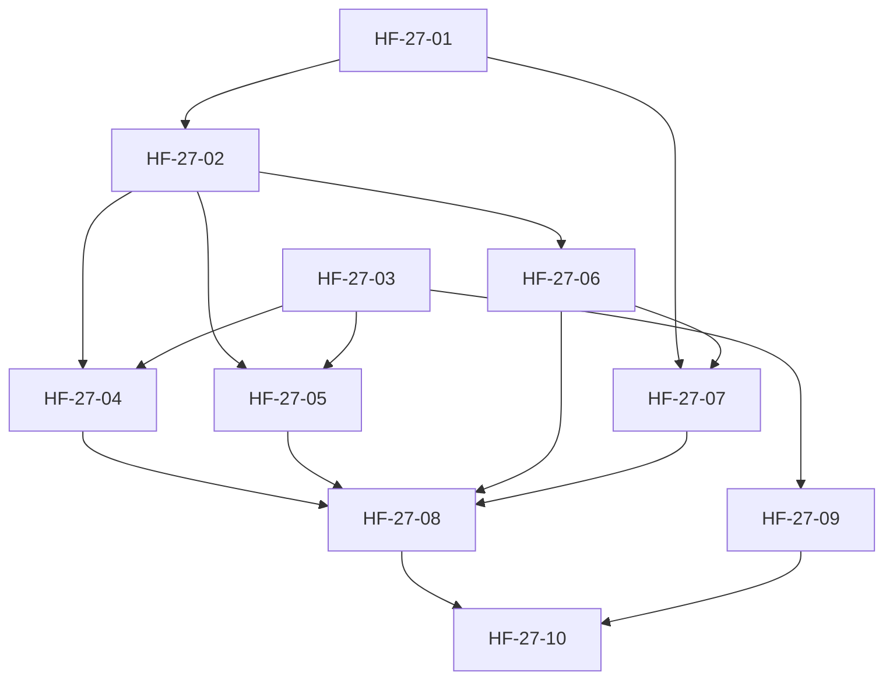

# HF-27 — Linha de produção autônoma · índice de handoffs

Plano mestre: [PRODUCTION_LINE_PLAN_2026-09-22.md](../../PRODUCTION_LINE_PLAN_2026-09-22.md). Todos os tickets foram implementados e integrados à baseline `main` (PRs #21, #23, #27, #33, #37).

| Ticket | Título | Papel | Estado | Depende de | Onda | Entrega / Commit |
| --- | --- | --- | --- | --- | --- | --- |
| [HF-27-01](HF-27-01.md) | Registry de projetos executável | economy | implemented | — | 1 | `8e075d8`, `a2d4ecd` |
| [HF-27-02](HF-27-02.md) | Workspace Git por run | economy | implemented | 01 | 1 | `b3218a8` |
| [HF-27-03](HF-27-03.md) | AgentCLI real + roteamento por quota | economy | implemented | — | 1 | `b3218a8` |
| [HF-27-04](HF-27-04.md) | Grill de rodada única + Planning | economy | implemented | 02, 03 | 2 | `9c57110`, `4a6a9c5` |
| [HF-27-05](HF-27-05.md) | Development + validate loop + review cruzada | economy | implemented | 02, 03 | 2 | `1541ce0`, `2fdcd83` |
| [HF-27-06](HF-27-06.md) | Integração GitHub via gh | economy | implemented | 02 | 2 | `feaa2f3`, `e66c959`, `59ba932` |
| [HF-27-07](HF-27-07.md) | Deploy + smoke + rollback por target | economy | implemented | 01, 06 | 2 | `b3218a8`, `fbefd06` |
| [HF-27-08](HF-27-08.md) | Ligar a linha no worker + DAG enxuto + canal humano | high_architecture / economy | implemented | 04, 05, 06, 07 | 3 | PR #33 (`dd6ccce`, `48789e8`) |
| [HF-27-09](HF-27-09.md) | Topologia VPS + on-prem | operations | implemented | 03 | 2 | `613192f`, `e1b96c9`, `21ff993` |
| [HF-27-10](HF-27-10.md) | Canário E2E diário + dogfood | economy | implemented | 08, 09 | 4 | PR #37 (`15aca31`) |
| [HF-27-11](../runbooks/desktop_test_worker.md) | Despacho remoto da suíte de validação | economy | implemented | 09 | 4 | `0d3e705`, `e227842` |

## Ownership de arquivos (disjunto por ticket, permite paralelismo)

| Ticket | Arquivos principais |
| --- | --- |
| 01 | `core/projects/models.py`, `core/projects/registry.py`, `core/projects/detect.py` (novo), `.factory/projects.json` |
| 02 | `core/line/__init__.py` (novo), `core/line/workspace.py` (novo) |
| 03 | `core/line/agent_cli.py` (novo), `core/line/routing.py` (novo), `.factory/config/line_routing.json` (novo), `core/harness/remote_worker.py` (só flags) |
| 04 | `core/line/stage_grill.py` (novo), `core/line/stage_planning.py` (novo), `core/line/prompts/` (novo) |
| 05 | `core/line/stage_build.py` (novo), `core/line/stage_review.py` (novo) |
| 06 | `core/line/stage_integration.py` (novo) |
| 07 | `core/line/stage_release.py` (novo), `core/orchestrator/deployment_adapter.py` (adiciona `FtpMirrorDeploymentAdapter`) |
| 08 | `core/line/bindings.py` (novo), `core/orchestrator/cloud_worker.py`, `core/workflow/successors.py`, `core/line/human.py` (novo) |
| 09 | `deploy/dokploy/Dockerfile.cloud`, `deploy/dokploy/docker-compose.cloud.yml`, `scripts/start_onprem_worker.ps1`, `deploy/dokploy/env.cloud.example` |
| 10 | `core/line/canary.py` (novo), `deploy/dokploy/docker-compose.cloud.yml` (serviço `canary`, serializado após 09) |

## Contrato comum da linha (vale para todos)

- A interface de etapa é a existente: `StageHandler.handle(StageContext) -> StageResult` (`core/workflow/control_contracts.py`). `success` exige `output_refs` reais (SHA de commit, URL de PR, ID de deploy, URL de smoke).
- O estado entre etapas vive **na branch** `df/<run_id>` do repo alvo, em `.darkfac/runs/<run_id>/`. Um handler nunca depende de memória de processo. Toda etapa começa com `workspace.checkout(run)` (fetch + reset para o tip remoto da branch).
- Idempotência: toda etapa verifica primeiro se o efeito já existe (commit com trailer `DarkFac-Job: <job_key>`, PR aberto para a branch, deploy com o mesmo SHA) e o reaproveita.
- Falhas usam `outcome`: `retry` (transitória), `failed` com `cause_code`, `replan` (spec errada) e `waiting_human` (só para os itens da seção 7 do plano).
- Testes focais em `tests/line/` com repositório Git temporário (`tmp_path`, `git init`) e um CLI falso (`scripts` stub no PATH) para as etapas de agente. Nenhum teste depende de rede.
- Validação global inalterada: `python core/harness/runner.py --quick` e `python -m pytest tests -v --ignore=tests/test_canaletto.py`.
